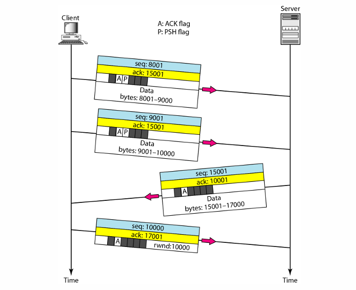

  <h1 style="text-align: center;font-weight: bold">Laporan Workshop Administrasi Jaringan</h1>
  <h4 style="text-align: center;">Dosen Pengampu : Dr. Ferry Astika Saputra, S.T., M.Sc.</h4>

 

  
  <h3 style="text-align: center;">Disusun Oleh :</h3>
  

    <strong>Maula Shahihah Nur Sa'adah</strong> 
    <strong>3123500008</strong>
  

<h3 style="text-align: center;line-height: 1.5">Politeknik Elektronika Negeri Surabaya Departemen Teknik Informatika Dan Komputer Program Studi Teknik Informatika 2024/2025</h3>
  

## Daftar Isi

1. [Analisa File http.cap Dengan Wireshark](#analisa-http-cap)
2. [Deskripsi Gambar Types of Data Deliveries](#deskripsi-gambar)
3. [Tahapan Komunikasi Menggunakan TCP](#rangkuman-tahapan-komunikasi-tcp)
4. [Referensi](#referensi)

## Analisa File http.cap Dengan Wireshark

### Versi HTTP yang digunakan

Versi HTTP yang digunakan dalam proses ini adalah HTTP/1.1, seperti terlihat pada request (GET /download.html HTTP/1.1) dan respons (HTTP/1.1 200 OK).

### IP address dari client dan server

IP address HTTP client : 145.254.160.237 
IP address HTTP server : 65.208.228.223

### Waktu dari client mengirimkan HTTP request

HTTP request dikirim oleh client (145.254.160.237) ke server (65.208.228.223) pada waktu ke 0.911310 detik.

### Waktu dari server mengirimkan HTTP respons

HTTP server dikirim oleh server (65.208.228.223) ke client (145.254.160.237) pada waktu ke 3.955688 detik.

### Durasi waktu yang dibutuhkan saat client mengirimkan request hingga server mengirimkan respons

Waktu untuk menyelesaikan HTTP respons adalah `4.846969 - 3.955688 = 0.891281` detik.

## Deskripsi Gambar Types of Data Deliveries

Gambar diatas menunjukkan tipe-tipe pengiriman data dalam jaringan berdasarkan OSI Layer :

<strong>Node to Node (<i>Data Link Layer</i>)</strong>

- Menentukan bagaimana bit-bit data dikelompokkan menjadi frame.
- Melakukan koreksi kesalahan dan flow control.
- Mengelola pengalamatan perangkat keras (MAC Address).
- Menentukan operasi perangkat jaringan seperti hub, bridge, repeater, dan switch layer 2.
- Dibagi menjadi dua sub-lapisan sesuai IEEE 802:
  - Logical Link Control (LLC): Menyiapkan retransmisi jika terjadi kegagalan paket.
  - Media Access Control (MAC): Mengatur akses langsung ke lapisan fisik berdasarkan metode akses media.
- Metode akses media:
  - CSMA/CD (Carrier Sense Multiple Access with Collision Detection):
    - Digunakan pada Ethernet untuk mendeteksi dan menangani tabrakan data.
    - Jika terjadi collision, perangkat menunggu waktu acak sebelum mencoba mengirim ulang.
  - CSMA/CA (Carrier Sense Multiple Access/Collision Avoidance):
    - Digunakan untuk menganalisis jaringan sebelum mengirim data guna menghindari tabrakan.
    - Mengirim sinyal broadcast sebelum transmisi untuk memastikan jalur aman.

<strong>Host to Host (<i>Network Layer</i>)</strong>

- Mendefinisikan alamat-alamat IP.
- Menyediakan fungsi routing untuk mengirim paket keluar dari segment network lokal.
- Memungkinkan pengiriman paket ke tujuan di network lain.
- Contoh protokol yang digunakan: IP (Internet Protocol).

<strong>Process to Process (<i>Transport Layer</i>)</strong>

- Memecah data menjadi paket-paket dan memberikan nomor urut agar dapat disusun kembali di tujuan.
- Mengirimkan tanda sukses (acknowledgement) setelah paket diterima.
- Retransmisi paket jika terjadi kehilangan data.
- Menggunakan protokol seperti UDP dan TCP.

## Tahapan Komunikasi Menggunakan TCP

<strong>Connection establishment using three-way handshaking</strong>

- SYN : Client mengirimkan paket SYN (synchronize) ke server untuk memulai koneksi.
- SYN + ACK : Server merespons dengan paket SYN-ACK sebagai tanda penerimaan.
- ACK : Client mengirimkan paket ACK (acknowledgment) untuk mengkonfirmasi koneksi telah terjalin.

<strong>Data transfer</strong>

- Data dikirim dalam bentuk segmen dengan nomor urut (sequence number).
- Penerima mengirim ACK untuk mengonfirmasi penerimaan data.
- TCP menggunakan kontrol aliran (flow control) dan pemeriksaan error untuk memastikan keandalan data.

<strong>Connection termination using three-way handshaking</strong>

- FIN: Salah satu pihak mengirimkan FIN untuk mengakhiri koneksi.
- ACK: Pihak penerima mengkonfirmasi dengan ACK.
- FIN: Pihak penerima kemudian mengirim FIN untuk menutup koneksi dari sisi mereka.
- ACK: Pengirim awal mengkonfirmasi dengan ACK, dan koneksi ditutup sepenuhnya.

## Referensi

- [OSI Layers](https://online.binus.ac.id/computer-science/2021/09/24/7-osi-layer/)
- [Komunikasi TCP](https://deriota.com/news/read/1504/memahami-tcpip-protokol-dasar-untuk-komunikasi-digital.html)
