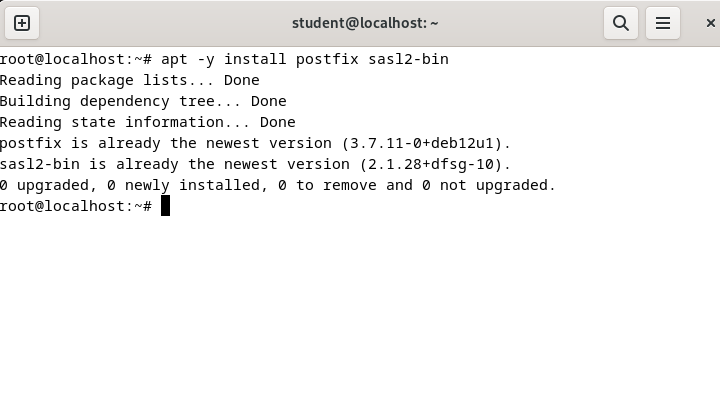
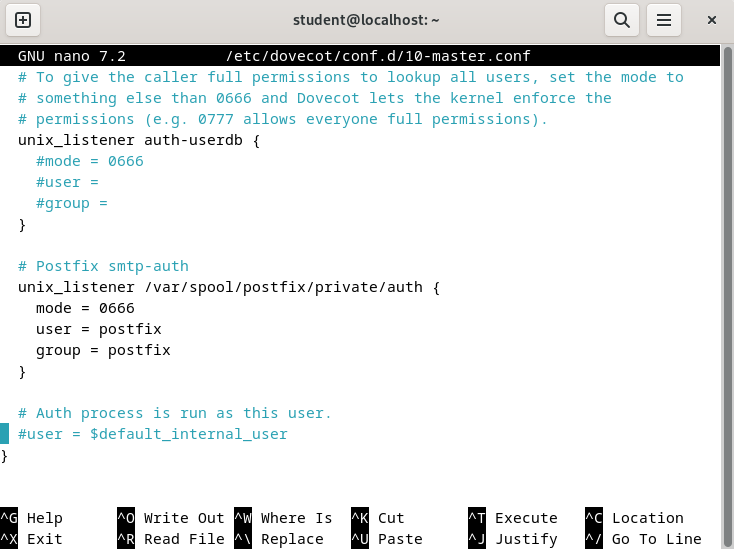

<div align="center">
  <h1 style="text-align: center;font-weight: bold">Laporan<br>Workshop Administrasi Jaringan</h1>
  <h4 style="text-align: center;">Dosen Pengampu : Dr. Ferry Astika Saputra, S.T., M.Sc.</h4>
</div>
<br />
<div align="center">
  
  <h3 style="text-align: center;">Disusun Oleh :</h3>
  <p style="text-align: center;">
    <strong>Maula Shahihah Nur Sa'adah</strong><br>
    <strong>3123500008</strong>
  </p>

<h3 style="text-align: center;line-height: 1.5">Politeknik Elektronika Negeri Surabaya<br>Departemen Teknik Informatika Dan Komputer<br>Program Studi Teknik Informatika<br>2024/2025</h3>
  <hr><hr>
</div>

## Daftar Isi

1. [Rangkuman Electronic Mail](#rangkuman-electronic-mail)
2. [Konfigurasi Mail Server](#konfigurasi-mail-server)
   - [Install Postfix](#install-postfix)
   - [Install Dovecot](#install-dovecot)
   - [Add Mail User Accounts](#add-mail-user-acc)
3. [Referensi](#referensi) 

## Introduction to Electronic Mail

**Surat elektronik  (e-mail)** adalah metode pertukaran pesan melalui internet. Yang merupakan salah satu layanan Internet yang paling banyak digunakan. Layanan ini memungkinkan pengguna Internet untuk mengirim pesan dalam format (surat) ke pengguna Internet lainnya di bagian mana pun di dunia. Pesan dalam surat tidak hanya berisi teks, tetapi juga berisi gambar, audio, dan data video. Orang yang mengirim surat disebut pengirim dan orang yang menerima surat disebut penerima.

Dasar-Dasar Email:
- **Alamat email**: Pengenal unik untuk setiap pengguna, biasanya dalam format nama@domain.com.
- **Klien email**: Program perangkat lunak yang digunakan untuk mengirim, menerima, dan mengelola email, seperti Gmail, Outlook, atau Apple Mail.
- **Server email**: Sistem komputer yang bertanggung jawab untuk menyimpan dan meneruskan email ke penerima yang dituju.

Langkah-Langkah Mengirim Email:
- Buat Pesan Baru
- Masukkan Alamat Penerima
- Tambahkan Subjek
- Tulis Isi Pesan
- Lampirkan Berkas (Opsional)
- Kirim Email

Komponen Sistem Email:


**Agen Pengguna (UA)**: merupakan program yang digunakan untuk mengirim dan menerima email, sering disebut sebagai pembaca email. UA memiliki kemampuan untuk menerima berbagai perintah seperti menulis, menerima, membalas pesan, serta mengelola kotak surat pengguna.

**Message Transfer Agent (MTA)**: MTA berperan sebagai komponen kunci yang bertanggung jawab untuk mentransfer email antar sistem. Untuk proses pengiriman, sistem memerlukan MTA klien dan MTA server. Jika penerima berada dalam sistem yang sama, MTA langsung mengirimkan email ke kotak surat tujuan, namun jika berbeda sistem, MTA akan berkomunikasi dengan MTA lain menggunakan protokol SMTP (Simple Mail Transfer Protocol).

**Kotak surat**: berfungsi sebagai penyimpanan lokal di hard drive untuk menyimpan semua email yang diterima. Pengguna dapat mengakses, membaca, dan mengelola email dalam kotak surat ini sesuai kebutuhan, dengan akses yang terbatas hanya untuk pemiliknya.

**File spool**: File ini sebagai tempat penyimpanan sementara untuk email yang akan dikirim. UA menambahkan email keluar ke file spool menggunakan SMTP, kemudian MTA akan mengambil dan memproses email tersebut untuk dikirimkan. Sistem email juga mendukung fitur alias dan milis, dimana sebuah nama dapat mewakili beberapa alamat email sekaligus. Ketika pengirim menggunakan alias, sistem akan memeriksa database untuk menentukan apakah alamat tersebut merupakan milis. Jika ya, email akan dikirim ke semua anggota milis; jika tidak, email akan dikirim sebagai pesan tunggal ke alamat yang dimaksud.

Layanan Sistem Email:

- **Komposisi** merupakan layanan pertama yang memungkinkan pembuatan pesan dan balasan, dimana pengguna dapat memanfaatkan berbagai editor teks untuk menyusun konten email. 
- **Transfer** berperan sebagai mekanisme pengiriman pesan dari pengirim menuju penerima melalui jaringan email. 
- **Pelaporan** memberikan konfirmasi status pengiriman, membantu pengguna melacak apakah email mereka berhasil terkirim, gagal, atau ditolak oleh sistem. 
- **Menampilkan** bertanggung jawab menyajikan pesan email dalam format yang mudah dipahami dan diakses oleh pengguna. 
- **Disposisi** mengatur tindakan lanjutan setelah email diterima, termasuk opsi untuk menyimpan pesan, menghapus sebelum dibaca, atau menghapus setelah dibaca sesuai kebutuhan penerima.

**Keuntungan dan Kerugian Email**

Keuntungan Email:
- Komunikasi yang mudah dan cepat dengan individu maupun kelompok di seluruh dunia
- Menyediakan kemudahan dalam menyimpan dan mencari kembali pesan-pesan lama
- Memiliki kemampuan untuk mengirim dan menerima berbagai lampiran seperti dokumen, gambar, dan video
- Lebih hemat biaya dibandingkan metode pengiriman tradisional seperti surat pos atau faksimili
- Tersedia dan dapat diakses 24 jam sehari, 7 hari seminggu tanpa batasan waktu

Kerugian Email:
- Rentan terhadap serangan spam dan phishing yang membahayakan keamanan data
- Banyaknya jumlah email yang diterima dapat menyebabkan overload informasi
- Berpotensi mengurangi intensitas komunikasi tatap muka dan kehilangan sentuhan pribadi
- Memiliki risiko miskomunikasi karena tidak adanya penekanan nada dan bahasa tubuh dalam pesan tertulis
- Dapat mengalami gangguan teknis seperti masalah server yang mengakibatkan layanan tidak berjalan optimal

## Konfigurasi Mail Server

### Install Postfix

**Instal Postfix digunakan untuk mengonfigurasi Server SMTP** 

#### Konfigurasi SMTP-Auth untuk menggunakan fungsi SASL Dovecot

1. Instalasi Paket Postfix dan sasl2-bin

   

2. Salin file konfigurasi default Postfix ke lokasi konfigurasi utama

   

3. Edit file `/etc/postfix/main.cf`

   Uncomment mail_owner

   

   Lakukan uncomment pada parameter **hostname** dan isikan sesuai dengan **hostname** yang telah dikonfigurasi di awal praktikum untuk masing-masing kelompok

   

   Lakukan uncomment pada parameter **domain** dan isikan sesuai dengan **domain** yang telah dikonfigurasi di awal praktikum untuk masing-masing kelompok

   

   Uncomment myorigin

   

   Uncomment inet_interfaces

   

   Uncomment mydestination

   

   Uncomment local_recipient_maps

   

   Uncomment mynetworks_style

   

   Tambahkan jaringan lokal yang terhubung dengan PC/server

   

   Uncomment alias_maps

   

   Uncomment alias_database

   

   Uncomment home_mailbox

   

   Comment baris `smtpd_banner` default Debian, kemudian tambahkan baris `smtpd_banner `baru yang tidak menggunakan variabel `$email_name`

   

   Tambahkan konfigurasi path untuk sendmail (`sendmail_path`), newaliases (`newaliases_path`), dan mailq (`mailq_path`), serta definisikan sebuah group baru (`setgid_group`) dalam file konfigurasi

   

   Comment out semua direktori yang tidak digunakan (`html_directory`, `manpage_directory`, `sample_directory`, dan `readme_directory`). Selain itu, ubah protokol inet dari IPv6 menjadi IPV4.

   

   Disable SMTP VRFY command, required HELO command, atur message size limit, dan tambahkan SMTP Auth Settings

   

   Jalankan perintah newaliases dan lakukan restart postfix

   

   Konfigurasi ini digunakan untuk menolak spam emails,  namun perlu diterapkan dengan hati-hati karena berpotensi juga menolak email legitimate (non-spam) apabila terdapat ketidaksesuaian dalam konfigurasi.

   

   Lakukan restart postfix

   

### Install Dovecot

**Install Devecot untuk mengonfigurasi server POP/IMAP**

#### Konfigurasi untuk menyediakan fungsi SASL ke Postfix

1. Instalasi dovecot

   

2. Konfigurasi file `/etc/dovecot/dovecot.conf`, dan lakukan uncomment pada baris ke 30

   

3. Konfigurasi file `/etc/dovecot/conf.d/10-auth.conf`, dan lakukan uncomment pada baris ke 10 & 100 dan ubah allow plain text auth

   

   

4. Konfigurasi file `/etc/dovecot/conf.d/10-mail.conf`, dan ubah mail location ke Maildir

   

5. Konfigurasi file `/etc/dovecot/conf.d/10-master.conf`, uncomment pada baris ke 107-109 dan tambahkan seperti dibawah ini

   

6. Lakukan restart dovecot

   

### Add Mail User Accounts

**Tambahkan akun pengguna mail untuk menggunakan mail server**

1. Instalasi mail client

   

2. Atur environment variable untuk maildir

   

3. Tambahkan OS user baru

    ``` bash
    add user student2
    ```

4. Mencoba untuk mengirim email ke user baru

   

5. Login sebagai user `student2` dan masukkan password 

    ``` bash
    su- student2
    ```

6. Cek email yang dikirim dari user `student` dengan perintah `mail`

   

   Dapat dilihat email sudah berhasil terkirim dan diterima

### Referensi

- [Introduction to Electronic Mail](https://www.geeksforgeeks.org/introduction-to-electronic-mail/) 
- [Mail Server Configuration](https://www.server-world.info/en/note?os=Debian_12&p=mail&f=1) 