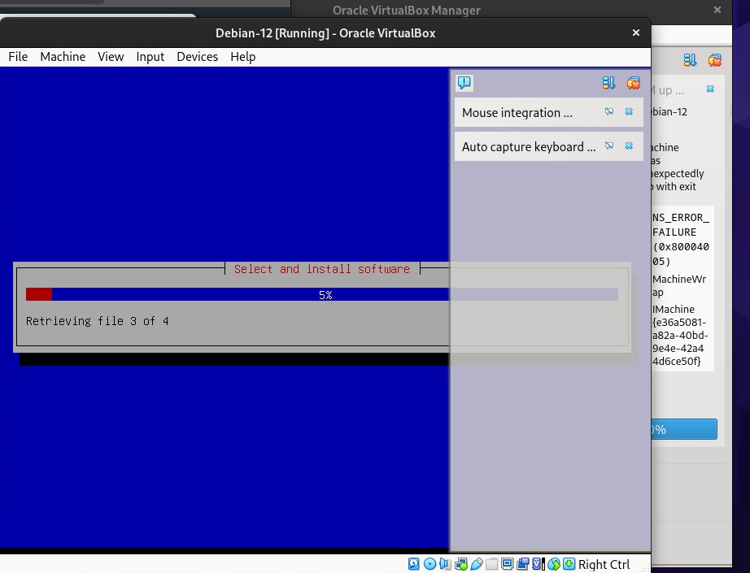

  <h1 style="text-align: center;font-weight: bold">Laporan Workshop Administrasi Jaringan</h1>
  <h4 style="text-align: center;">Dosen Pengampu : Dr. Ferry Astika Saputra, S.T., M.Sc.</h4>

 

  
  <h3 style="text-align: center;">Disusun Oleh :</h3>
  

    <strong>Maula Shahihah Nur Sa'adah</strong> 
    <strong>3123500008</strong>
  

<h3 style="text-align: center;line-height: 1.5">Politeknik Elektronika Negeri Surabaya Departemen Teknik Informatika Dan Komputer Program Studi Teknik Informatika 2024/2025</h3>
  

## Daftar Isi

1. [Instalasi Debian Linux Pada VirtualBox](#instalasi-debian)
2. [Kesimpulan](#kesimpulan)

## Instalasi Debian Linux di VirtualBox melalui terminal root pada OS Linux

#### Solve LAN Wired Not Connected

Perintah `sudo dhclient -v` digunakan untuk memperbarui konfigurasi jaringan secara dinamis melalui DHCP dan menampilkan output secara detail.

#### Install Git dan Clone Github

Command `sudo appt install git` digunakan untuk menginstall git pada komputer lab.

Kemudian clone menggunakan git clone dengan cara paste link github dibawah ini:

`https://github.com/ferryastika/unix-and-linux-sysadmin-notes.git`

#### Download VirtualBox Linux

Klik pada bagian Linux distributions.

Kemudian pilih Debian 12, lalu klik untuk mendownload.

Jika proses download sudah selesai, maka file VirtualBox akan masuk pada folder Downloads.

#### Download ISO Debian 12

ISO yang akan digunakan dalam VirtualBox.

#### Proses Instalasi VirtualBox

Pada folder Downloads tadi, klik kanan file VirtualBox lalu pilih Open Terminal. Jalankan dengan perintah dibawah ini untuk melalukan instalasi VirtualBox.

Dari capture diatas terdapat error yang terjadi karena dependensi yang dibutuhkan oleh VirtualBox belum terinstal, khususnya `libxcb-cursor0`. Saat menggunakan `dpkg -i`, hanya paket yang dipilih yang diinstal tanpa secara otomatis menyelesaikan dependensi yang hilang. Karena `libxcb-cursor0` tidak ditemukan di sistem, proses instalasi VirtualBox gagal dengan status "dependency problems".

Untuk mengatasi permasalahan diatas, dapat dijalankan dengan perintah berikut:

Perintah `sudo apt install -f` akan menginstal semua dependensi yang hilang dan memperbaiki konfigurasi yang belum selesai, sehingga VirtualBox dapat terinstal dengan benar.

#### Menjalankan Virtual Machine

Error `Can't enumerate USB devices` di VirtualBox terjadi karena sistem gagal mengenali USB, biasanya akibat dukungan USB belum aktif, kurangnya izin user, atau Extension Pack belum terinstal. Masalah ini sering terjadi di Linux jika user belum masuk grup `vboxusers`. 

Jika menggunakan Linux, user perlu memiliki izin untuk mengakses perangkat USB di VirtualBox. Maka jalankan perintah diatas di terminal, lalu restart sistem agar perubahan diterapkan.

#### Menjalankan New Virtual Machine

Jika tampilan sudah seperti ini, maka akan lanjut ke langkah berikutnya.

#### Langkah - langkah

Sesuaikan Name and Operating System seperti gambar diatas. Jika sudah download file ISO Debian 12 tadi, berikan lokasi file ISO tersebut pada kolom ISO Image.

Melakukan setting username dan password yang sama dengan nama `student`.

Setting up RAM sebesar 2 GB dan Proccessors menggunakan 2 CPU.

Menggunakan 10 GB untuk alokasi memory pada HDD.

Jika sudah sesuai dengan spesifikasi yang diinginkan maka lanjut klik Finish untuk memproses instalasi.

#### Error Pada Kernel

Setelah mengklik Finish, muncul pop up error seperti dibawah ini.

Error `Kernel driver not installed (rc=-1908)` terjadi karena VirtualBox tidak dapat menemukan atau memuat driver kernel (vboxdrv) yang diperlukan. Penyebabnya bisa karena Secure Boot masih aktif, modul kernel belum terinstal, atau VirtualBox perlu dikonfigurasi ulang setelah pembaruan sistem.

Dari problem diatas, dapat dijalankan dengan perintah berikut untuk memuat ulang driver kernel.

#### Proses Instalasi Debian Berjalan

Jalankan dan tunggu hingga Debian pada VM terinstal dan terinisialisasi dengan benar.

Jika tampilan sudah seperti dibawah ini, maka instalasi Debian 12 di VirtualBox telah berhasil.

## Kesimpulan

Kesimpulannya, error pada VirtualBox, seperti `Kernel driver not installed (rc=-1908)` dan `Can't enumerate USB devices`, umumnya disebabkan oleh konfigurasi yang belum lengkap, izin yang kurang, atau modul yang belum terinstal. Untuk mengatasinya yaitu meliputi menambahkan user ke grup `vboxusers`, serta menginstal dan mengonfigurasi ulang driver kernel. Jika menjalankan Debian 12 di VirtualBox, user harus mendownload ISO dan sistem dikonfigurasi dengan benar agar dapat berjalan tanpa ada problem.