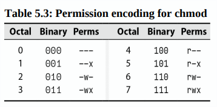

<div align="center">
  <h1 style="text-align: center;font-weight: bold">Laporan<br>Workshop Administrasi Jaringan</h1>
  <h4 style="text-align: center;">Dosen Pengampu : Dr. Ferry Astika Saputra, S.T., M.Sc.</h4>
</div>
<br />
<div align="center">
  
  <h3 style="text-align: center;">Disusun Oleh :</h3>
  <p style="text-align: center;">
    <strong>Maula Shahihah Nur Sa'adah</strong><br>
    <strong>3123500008</strong>
  </p>

<h3 style="text-align: center;line-height: 1.5">Politeknik Elektronika Negeri Surabaya<br>Departemen Teknik Informatika Dan Komputer<br>Program Studi Teknik Informatika<br>2024/2025</h3>
  <hr><hr>
</div>

## Chapter 5: The Filesystem

### Daftar Isi

- [Pathnames](#pathnames)
- [Filesystem Mounting and Unmounting](#filesystem)
- [Organization of the file tree](#organization-file-tree)
- [File types](#dile-types)
- [File attributes](#file-attributes)
- [Access Control Lists](#access-control-lists)


Tujuan dasar dari sistem berkas (filesystem) adalah untuk merepresentasikan dan mengorganisir sumber daya penyimpanan dalam sistem.

Sistem berkas terdiri dari empat komponen utama:

- **Namespace** – Cara untuk memberi nama pada objek dan mengorganisirnya dalam sebuah hierarki.
- **API** – Kumpulan panggilan sistem (system calls) untuk menavigasi dan memanipulasi objek.
- **Model keamanan** – Skema untuk melindungi, menyembunyikan, dan membagikan objek.
- **Implementasi** – Perangkat lunak yang menghubungkan model logis dengan perangkat keras.

Sistem berkas berbasis disk yang umum digunakan meliputi ext4, XFS, UFS, ZFS, dan Btrfs, serta sistem lain seperti VxFS dari Veritas dan JFS dari IBM. Selain itu, terdapat sistem berkas asing seperti FAT dan NTFS untuk Windows serta ISO 9660 untuk CD/DVD. Sebagian besar sistem berkas modern berfokus pada peningkatan kecepatan, keandalan, dan penambahan fitur tambahan di atas standar tradisional.

### Pathnames

Pathname adalah sebuah string yang menunjukkan lokasi berkas dalam hierarki sistem berkas. Istilah "directory" lebih teknis dibandingkan "folder", yang berasal dari dunia Windows dan macOS, sehingga sebaiknya digunakan dalam konteks teknis. Pathname dapat berupa absolut (misalnya, `/home/username/file.txt`) atau relatif (misalnya, `./file.txt`).

### Filesystem Mounting and Unmounting

Sistem berkas terdiri dari bagian-bagian kecil yang disebut **filesystems**, masing-masing berisi satu direktori beserta subdirektori dan berkas-berkasnya. File tree menggambarkan tata letak keseluruhan sistem berkas, sementara filesystem merujuk pada cabang yang terhubung ke pohon tersebut.

Dalam banyak kasus, sistem berkas dipasang (mounted) ke dalam file tree menggunakan perintah **mount**, yang menghubungkan direktori dalam file tree yang ada (**mount point**) ke root dari sistem berkas baru.

Contoh:

```bash
# Mount the filesystem on /dev/sda4 to /users
mount /dev/sda4 /users
```

Linux menyediakan opsi **lazy unmount** (`umount -l`), yang menghapus sistem berkas dari hierarki nama tetapi tetap mempertahankannya hingga tidak lagi digunakan. Selain itu, terdapat **forceful unmount** (`umount -f`), yang berguna jika sistem berkas sedang sibuk. 

Sebagai alternatif, Anda dapat menggunakan **lsof** atau **fuser** untuk menemukan proses yang menggunakan sistem berkas dan menutupnya sebelum mencoba melepaskannya.

Contoh:

```bash
# Find out which processes are using the filesystem

abdou@debian:~$ lsof /home/abdou

COMMAND   PID USER   FD   TYPE DEVICE SIZE/OFF   NODE NAME
bash     1000 abdou  cwd    DIR    8,1     4096  131073 /home/abdou
bash     1000 abdou  rtd    DIR    8,1     4096  131073 /home/abdou
bash     1000 abdou  txt    REG    8,1   103752  131072 /bin/bash
bash     1000 abdou  mem    REG    8,1  1848400  131074 /lib/x86_64-linux-gnu/libc-2.28.so
bash     1000 abdou  mem    REG    8,1   170864  131075 /lib/x86_64-linux-gnu/ld-2.28.so
code     1234 abdou  cwd    DIR    8,1     4096  131073 /home/abdou
msedge   5678 abdou  cwd    DIR    8,1     4096  131073 /home/abdou
```

Untuk menganalisis lebih lanjut proses-proses tersebut,dapat menggunakan perintah **ps**.

Contoh:

```bash
# Investigate the processes that are using the filesystem

abdou@debian:~$ ps up "1234 5678 91011"

USER       PID %CPU %MEM    VSZ   RSS TTY      STAT START   TIME COMMAND
abdou     1234  0.0  0.0  12345  1234 ?        Ssl  00:00   0:00 code
abdou     5678  0.0  0.0  12345  1234 ?        Ssl  00:00   0:00 msedge
abdou     91011  0.0  0.0  12345  1234 ?        Ssl  00:00   0:00 chrome
```

### Organization of the file tree

Sistem UNIX tidak sepenuhnya terorganisir dengan baik karena berbagai konvensi penamaan yang tidak kompatibel digunakan secara bersamaan, menyebabkan berkas tersebar secara acak dan menyulitkan pembaruan sistem. 

Root filesystem mencakup direktori root (`/`) beserta sejumlah minimal berkas dan subdirektori, termasuk kernel, yang biasanya berada di` /boot`, meskipun lokasinya dapat bervariasi. 

Direktori seperti `/etc` menyimpan konfigurasi sistem,` /sbin` dan `/bin` berisi utilitas penting, sedangkan `/tmp` digunakan untuk berkas sementara. `/dev`, yang dulunya bagian dari root filesystem, kini menjadi filesystem virtual yang dipasang terpisah. 

Berkas pustaka bersama (`shared libraries`) disimpan di `/lib`, `/lib64`, atau `/usr/lib`, dengan `/lib` kadang hanya sebagai symbolic link. 

Direktori `/usr` menyimpan program standar yang tidak kritis bagi sistem, manual daring, dan pustaka, sementara `/var` digunakan untuk data yang sering berubah seperti log sistem dan informasi akuntansi. Kedua direktori ini harus tersedia agar sistem dapat berjalan dalam mode multiuser.


### File types

Sebagian besar implementasi sistem berkas mendefinisikan tujuh jenis berkas:

- regular files 
- directories 
- character device files 
- block device files 
- local domain sockets 
- named pipes (FIFOs) 
- symbolic links

Untuk menentukan jenis suatu berkas dengan menggunakan perintah **file** (ketik **man file** untuk informasi lebih lanjut).

```bash
$ file /bin/bash
bin/bash: ELF 64-bit LSB pie executable, x86-64, version 1 (SYSV), dynamically linked, interpreter /lib64/ld-linux-x86-64.so.2, BuildID[sha1]=33a5554034feb2af38e8c75872058883b2988bc5, for GNU/Linux 3.2.0, stripped
```

Juga dapat menggunakan **ls -ld**, di mana opsi **-d** memaksa **ls** untuk menampilkan informasi tentang direktori itu sendiri, bukan isinya.


Regular files adalah kumpulan byte tanpa struktur tertentu yang dapat berupa berkas teks, data, program eksekusi, atau pustaka bersama. 

Directories adalah referensi yang menunjuk ke berkas lain. 

Hard links memungkinkan satu berkas memiliki beberapa nama menggunakan perintah ln, sementara symbolic links (soft links) lebih fleksibel karena dapat menunjuk ke berkas pada sistem berkas yang berbeda atau ke direktori.

Contoh: 

```bash
$ ln /etc/passwd /tmp/passwd
```

Character and block device files

Device files memungkinkan komunikasi antara program dan perangkat keras. Mereka memiliki nomor mayor untuk mengidentifikasi driver dan nomor minor untuk unit perangkat tertentu. Saat ini, direktori `/dev` dikelola otomatis oleh kernel dan daemon pengguna, menggantikan sistem manual sebelumnya.

Local domain sockets dan named pipes memungkinkan komunikasi antarproses dalam satu host, dengan local domain sockets digunakan dalam syslog dan X Window System. 

Symbolic links memberikan nama tambahan pada berkas dengan menunjuk ke nama berkas lain. Berbeda dengan hard links, symbolic links dapat menunjuk ke berkas atau direktori di sistem berkas lain. 

Contohnya, direktori `/usr/bin` sering kali berupa symbolic link ke` /bin` untuk menjaga ukuran root filesystem tetap kecil dan mempermudah berbagi perangkat lunak di beberapa host.

```bash
$ ln -s /bin /usr/bin

$ ls -l /usr/bin
lrwxrwxrwx 1 root root 4 Mar  1  2020 /usr/bin -> /bin
```

### File attributes

Setiap berkas dalam sistem Unix dan Linux memiliki sembilan bit izin untuk mengatur akses baca, tulis, dan eksekusi, serta tiga bit tambahan untuk program yang dapat dieksekusi. 

Bersama dengan empat bit tipe berkas, bit-bit ini membentuk mode berkas. Bit tipe berkas tidak dapat diubah, tetapi pemilik berkas dan superuser dapat mengubah bit mode menggunakan perintah chmod.


#### Permission bits

Bit izin dibagi menjadi tiga kelompok yang masing-masing terdiri dari tiga bit. Kelompok pertama untuk pemilik berkas, kelompok kedua untuk grup berkas, dan kelompok ketiga untuk pengguna lainnya. Urutan ini dapat diingat dengan akronim Hugo: u untuk pemilik (user), g untuk grup, dan o untuk lainnya (others).

Izin juga dapat dinyatakan dalam notasi oktal (basis 8), di mana setiap digit mewakili tiga bit. Tiga bit teratas (bernilai oktal 400, 200, dan 100) untuk pemilik, tiga bit tengah (40, 20, dan 10) untuk grup, dan tiga bit terbawah (4, 2, dan 1) untuk lainnya.

Bit baca memungkinkan membaca berkas, bit tulis untuk memodifikasi, sedangkan penghapusan dikendalikan oleh izin direktori induk. Bit eksekusi memungkinkan menjalankan berkas sebagai biner atau skrip, dengan skrip menggunakan shebang untuk menentukan interpreter.

```bash
#!/usr/bin/perl
```

Berkas eksekusi non-biner tanpa interpreter yang ditentukan dianggap sebagai skrip **sh**. Kernel mengenali sintaks *#!* (shebang) dan mengeksekusinya langsung, tetapi jika interpreter tidak ditentukan dengan benar, kernel akan menolak berkas tersebut, lalu shell mencoba menafsirkannya sebagai skrip shell.

Pada direktori, bit eksekusi (disebut juga search atau scan bit) memungkinkan direktori dimasuki atau dilewati saat mengevaluasi path, tetapi tidak untuk menampilkan isinya. Kombinasi bit baca dan eksekusi memungkinkan isi direktori dibaca dan ditampilkan, sementara kombinasi bit tulis dan eksekusi memungkinkan pembuatan, penghapusan, dan penggantian nama berkas dalam direktori.

#### The setuid and setgid bits

Bit dengan nilai oktal 4000 dan 2000 adalah bit setuid dan setgid. Bit setuid memungkinkan suatu berkas dijalankan dengan hak akses pemiliknya, sementara bit setgid membuat berkas dijalankan dengan hak akses grupnya. 

Jika bit setgid diterapkan pada direktori, semua berkas baru yang dibuat di dalamnya akan mewarisi kepemilikan grup dari direktori tersebut, bukan dari pengguna yang membuatnya, sehingga mempermudah berbagi berkas antar pengguna dalam satu grup.

#### The sticky bit

Bit dengan nilai oktal 1000 disebut sticky bit. Jika diterapkan pada direktori, sticky bit mencegah pengguna menghapus atau mengganti nama berkas yang bukan miliknya. Fitur ini berguna untuk direktori seperti /tmp yang digunakan bersama oleh banyak pengguna.

#### ls: list and inspect files

Perintah `ls` digunakan untuk menampilkan daftar berkas dan direktori, serta memeriksa atributnya.

Opsi `-l` menampilkan format panjang yang mencakup mode berkas, jumlah hard link, pemilik, grup, ukuran dalam byte, waktu modifikasi, dan nama berkas.

Setiap direktori memiliki minimal dua hard link: satu dari direktori itu sendiri (.) dan satu dari induknya (..).

Untuk berkas perangkat, output `ls` sedikit berbeda. Misalnya:

```bash
$ ls -l /dev/tty0
crw--w---- 1 root tty 4, 0 Mar  1  2020 /dev/tty0
```

Huruf **c** di awal menunjukkan bahwa berkas tersebut adalah berkas perangkat karakter, sedangkan angka **4, 0** adalah nomor perangkat mayor dan minor.

#### chmod: change permissions

Perintah `chmod` digunakan untuk mengubah mode berkas.Dapat menggunakan notasi oktal atau notasi simbolik.



| Specifier  | Meaning                                                             |
| ---------- | ------------------------------------------------------------------- |
| u+w        | Add write permission for the file's owner                           |
| ug=rw,o=r  | Gives r/w permission to owner and group, and r permission to others |
| a-x        | Remove execute permission for all users                             |
| ug=srx, o= | Set the setuid, setgid, and sticky bits for owner and group (r/x)   |
| g=u        | Make the group's permissions the same as the owner's                |

Tips: Dapat menentukan mode yang akan ditetapkan dengan menyalin mode dari file lain dengan opsi --reference. (contoh: chmod --reference = file sumber file target)

#### chown: change ownership

Perintah `chown` digunakan untuk mengubah pemilik dan grup suatu berkas. Opsi `-R` memungkinkan chown mengubah kepemilikan isi berkas secara rekursif.

```bash
$ chown -R abdou:users /home/abdou
```

#### chgrp: change group

Perintah `chgrp` digunakan untuk mengubah grup suatu berkas. Opsi `-R` memungkinkan chgrp mengubah grup isi berkas secara rekursif.

```bash
$ chgrp -R users /home/abdou
```

#### umask: set default permissions

Perintah `umask` menetapkan izin default untuk berkas dan direktori baru. `umask` adalah bit mask yang dikurangkan dari izin default untuk menentukan izin akhir yang diterapkan.

Contoh:

```bash
$ umask 022
```

| Octal | Binary | Perms | Octal | Binary | Perms |
| ----- | ------ | ----- | ----- | ------ | ----- |
| 0     | 000    | rwx   | 4     | 100    | -wx   |
| 1     | 001    | rw-   | 5     | 101    | -w-   |
| 2     | 010    | r-x   | 6     | 110    | --x   |
| 3     | 011    | r--   | 7     | 111    | ---   |

Sebagai contoh, umask 027 mengizinkan rwx untuk pemilik, rx untuk grup, dan tidak ada izin untuk orang lain.

### Access Control Lists

Access Control Lists (ACL) memperluas model izin Unix dengan memungkinkan satu berkas memiliki beberapa pemilik dan memberikan izin berbeda kepada grup pengguna. 

Setiap aturan dalam ACL disebut Access Control Entry (ACE), yang terdiri dari penentu pengguna/grup, hak akses, dan tipe (allow atau deny). 

Perintah `getfacl` digunakan untuk menampilkan ACL, sedangkan `setfacl` digunakan untuk mengaturnya.

```bash
$ getfacl /etc/passwd
```

```bash
$ setfacl -m u:abdou:rw /etc/passwd
```

Terdapat dua jenis ACL: POSIX ACLs (ACL tradisional Unix) dan NFSv4 ACLs (versi lebih canggih dan fleksibel).

#### Implementation of ACLs

Secara teori, tanggung jawab untuk memelihara dan menegakkan ACL dapat diberikan kepada beberapa komponen sistem. ACL dapat diimplementasikan oleh kernel untuk semua sistem berkas, oleh masing-masing sistem berkas, atau oleh perangkat lunak tingkat lebih tinggi seperti server NFS dan SMB.

#### POSIX ACLs

POSIX ACL adalah ACL tradisional Unix yang didukung oleh sebagian besar sistem operasi berbasis Unix, termasuk Linux, FreeBSD, dan Solaris.

| Format                | Example         | Sets permissions for      |
| --------------------- | --------------- | ------------------------- |
| user::perms           | user:rw-        | The file's owner          |
| user:username:perms   | user:abdou:rw-  | The user named username   |
| group::perms          | group:r-x       | The file's group          |
| group:groupname:perms | group:users:r-x | The group named groupname |
| mask::perms           | mask::rwx       | The maximum permissions   |
| other::perms          | other::r--      | Everyone else             |

Contoh: 

```bash
$ setfacl -m user:abdou:rwx,group:users:rwx,other::r /home/abdou

$ getfacl --omit-header /home/abdou

user::rwx
user:abdou:rwx
group::r-x
group:users:r-x
mask::rwx
other::r--
```

#### NFSv4 ACLs

NFSv4 ACL adalah jenis ACL yang lebih baru dan lebih canggih. Mereka didukung oleh beberapa sistem operasi berbasis Unix, termasuk Linux dan FreeBSD.

NFSv4 ACL mirip dengan POSIX ACL tetapi memiliki fitur tambahan, seperti ACL default yang digunakan untuk menetapkan ACL pada berkas dan direktori baru.

### Kesimpulan

Kesimpulannya, sistem file dalam Unix dan Linux memiliki berbagai jenis berkas, termasuk berkas reguler, direktori, perangkat karakter dan blok, serta symbolic link. Setiap berkas memiliki atribut izin yang mengatur siapa yang dapat membaca, menulis, dan mengeksekusinya.

Model izin tradisional Unix menggunakan bit izin untuk pemilik, grup, dan lainnya. Namun, untuk fleksibilitas lebih, Access Control Lists (ACL) memungkinkan pengelolaan izin yang lebih kompleks, termasuk memberikan beberapa pemilik atau izin berbeda untuk berbagai grup pengguna.

Ada dua jenis ACL utama: POSIX ACL yang merupakan standar Unix lama dan NFSv4 ACL yang lebih canggih dengan fitur tambahan seperti ACL default. Pengelolaan izin ini dapat dilakukan melalui perintah seperti `chmod`, `chown`, `chgrp`, `getfacl`, dan `setfacl`.