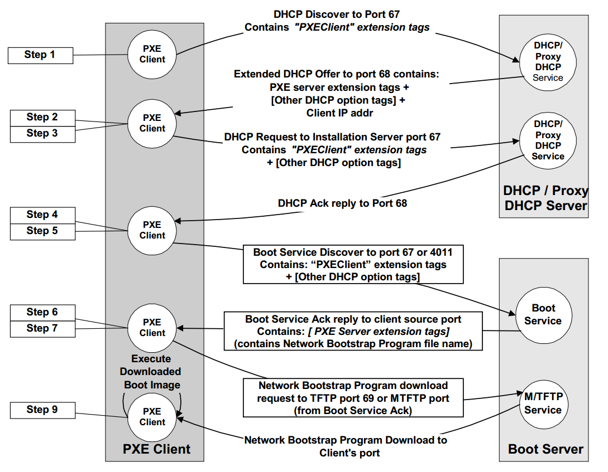

  <h1 style="text-align: center;font-weight: bold">Laporan Workshop Administrasi Jaringan</h1>
  <h4 style="text-align: center;">Dosen Pengampu : Dr. Ferry Astika Saputra, S.T., M.Sc.</h4>

 

  
  <h3 style="text-align: center;">Disusun Oleh :</h3>
  

    <strong>Maula Shahihah Nur Sa'adah</strong> 
    <strong>3123500008</strong>
  

<h3 style="text-align: center;line-height: 1.5">Politeknik Elektronika Negeri Surabaya Departemen Teknik Informatika Dan Komputer Program Studi Teknik Informatika 2024/2025</h3>
  

## Chapter 6: Software Installation and Management

### Daftar Isi

- [Operating System Installation](#os-installation)
- [Linux Package Management Systems](#linux-package)
- [High-Level Package Management](#high-level-package)
- [Software localization and configuration](#software-localization)

### Operating System Installation

Distribusi Linux dan FreeBSD memiliki prosedur instalasi dasar yang sederhana. Untuk mesin fisik, boot dapat dilakukan dari CD, DVD, atau USB drive. Untuk mesin virtual, boot dapat dilakukan dari file ISO. Instalasi sistem operasi dasar dari media lokal cukup mudah berkat aplikasi GUI yang memandu prosesnya.

#### Installation from the network

Instalasi OS dengan media lokal memiliki keterbatasan karena memakan waktu, rentan terhadap kesalahan, dan membosankan jika dilakukan berulang kali. Solusi yang lebih efisien adalah menginstal OS dari server jaringan, yang sering digunakan di pusat data dan lingkungan cloud.

Metode umum untuk instalasi jaringan menggunakan DHCP dan TFTP untuk booting tanpa media fisik, lalu mengambil file instalasi OS dari server melalui HTTP, FTP, atau NFS. File instalasi dapat disimpan di server yang sama atau berbeda.

PXE (Preboot eXecution Environment) memungkinkan instalasi OS otomatis tanpa intervensi pengguna. PXE adalah standar dari Intel yang memungkinkan sistem booting langsung dari jaringan.

PXE bekerja sebagai OS kecil di dalam ROM kartu jaringan dan menyediakan API standar untuk BIOS sistem. Hal ini memungkinkan satu boot loader melakukan netboot di semua PC yang mendukung PXE tanpa perlu driver khusus untuk setiap kartu jaringan.

### Linux Package Management Systems

Linux menggunakan dua format paket utama: RPM yang digunakan oleh Red Hat, CentOS, SUSE, Amazon Linux, dan lainnya, serta `.deb` yang digunakan oleh Debian dan Ubuntu. Keduanya memiliki fungsi yang serupa.

Sistem manajemen paket RPM dan `.deb` kini berfungsi sebagai alat konfigurasi lengkap, dengan perintah dasar seperti `rpm` untuk RPM dan `dpkg` untuk `.deb` yang digunakan untuk menginstal, menghapus, dan menelusuri paket.

Di tingkat yang lebih tinggi, sistem seperti `yum` untuk RPM dan `APT` untuk` .deb` dapat mengunduh paket dari internet, menganalisis ketergantungan, dan memperbarui paket di sistem. APT juga dapat digunakan dengan paket RPM.

### High-Level Package Management

Alat manajemen paket tingkat tinggi sering digunakan karena memudahkan pengelolaan paket, seperti instalasi, penghapusan, pembaruan, serta pencarian dan daftar paket yang terpasang di sistem.

#### Package repositories

Distributor Linux mengelola repositori perangkat lunak yang bekerja bersama dengan sistem manajemen paket yang mereka gunakan. Secara default, sistem manajemen paket dikonfigurasi untuk mengakses satu atau lebih server web atau FTP yang dikendalikan oleh distributor.

- Rilis adalah kumpulan paket yang stabil dalam satu versi sistem.
- Komponen adalah bagian dari perangkat lunak dalam sebuah rilis.
- Arsitektur mengacu pada jenis perangkat keras yang dapat menjalankan biner yang sama dalam satu kelas arsitektur, seperti arsitektur i386 pada rilis Fedora 20.

#### APT: Advanced Package Tool

APT (Advanced Package Tool) adalah sekumpulan alat untuk mengelola paket Debian dan merupakan sistem manajemen paket yang paling banyak digunakan pada sistem berbasis Debian.

Beberapa alat dalam APT meliputi:

- apt-get: Mengelola paket melalui command-line, termasuk instalasi, penghapusan, dan pembaruan.
- apt-cache: Mencari dan menampilkan informasi dalam cache paket APT.
- apt-file: Mencari file dalam paket.
- apt-show-versions: Menampilkan versi paket.
- aptitude: Antarmuka tingkat tinggi yang dapat melakukan tugas yang sama seperti apt-get dan lebih banyak lagi.
- apt-mirror: Memungkinkan pembuatan mirror repositori paket.

Pada sistem Ubuntu, disarankan untuk mengabaikan keberadaan **dselect**, yang merupakan antarmuka frontend untuk sistem paket Debian.

#### yum: Yellowdog Updater, Modified

Yum (Yellowdog Updater, Modified) adalah manajer paket untuk sistem Linux yang kompatibel dengan RPM. Ini merupakan alat tingkat tinggi untuk mengelola paket. Yum menyelesaikan dependensi saat menginstal, memperbarui, dan menghapus paket. Selain itu, Yum dapat mengelola paket dari repositori yang terpasang serta melakukan operasi melalui command-line pada paket tertentu.

### Software localization and configuration

Menyesuaikan sistem dengan lingkungan lokal atau cloud secara terstruktur membantu menghindari terciptanya sistem unik (snowflake systems) yang sulit dipulihkan setelah terjadi insiden besar.

### Kesimpulan

Manajemen perangkat lunak di Linux bergantung pada sistem manajemen paket yang efisien untuk instalasi, pembaruan, dan penghapusan perangkat lunak. Linux menggunakan dua format paket utama: RPM (digunakan oleh Red Hat, CentOS, SUSE) dan .deb (digunakan oleh Debian, Ubuntu).

Untuk mengelola paket, terdapat berbagai alat bantu seperti APT (untuk Debian-based) dan yum (untuk RPM-based), yang dapat menangani dependensi dan mengelola paket dari repositori resmi. Repositori ini memastikan akses ke perangkat lunak yang aman dan terbaru.

Selain instalasi dari media lokal, sistem dapat dipasang melalui jaringan menggunakan PXE, yang memungkinkan instalasi otomatis tanpa media fisik. Melalui metode yang terstruktur, sistem dapat disesuaikan dengan lingkungan lokal atau cloud tanpa menciptakan konfigurasi yang sulit dipulihkan.