<div align="center">
  <h1 style="text-align: center;font-weight: bold">Laporan<br>Workshop Administrasi Jaringan</h1>
  <h4 style="text-align: center;">Dosen Pengampu : Dr. Ferry Astika Saputra, S.T., M.Sc.</h4>
</div>
<br />
<div align="center">
  
  <h3 style="text-align: center;">Disusun Oleh :</h3>
  <p style="text-align: center;">
    <strong>Maula Shahihah Nur Sa'adah</strong><br>
    <strong>3123500008</strong>
  </p>

<h3 style="text-align: center;line-height: 1.5">Politeknik Elektronika Negeri Surabaya<br>Departemen Teknik Informatika Dan Komputer<br>Program Studi Teknik Informatika<br>2024/2025</h3>
  <hr><hr>
</div>

## Daftar Isi

1. [Install dan Konfigurasi Network Time Protocol](#konfigurasi-ntp)
2. [Instalasi dan Konfigurasi Samba](#konfigurasi-samba)
3. [Package Management](#package-management)
4. [Kesimpulan](#kesimpulan)

## Konfigurasi Network Time Protocol (NTP)

### Instalasi dan Konfigurasi NTP

NTP Client (Network Time Protocol Client) adalah perangkat atau aplikasi yang bertugas untuk menyelaraskan waktu sistem dengan server waktu melalui protokol NTP. NTP adalah protokol jaringan yang dirancang untuk menyinkronkan jam komputer di seluruh jaringan dengan tingkat akurasi yang sangat tinggi, biasanya dalam rentang milidetik.

#### Instalasi package ntpsec

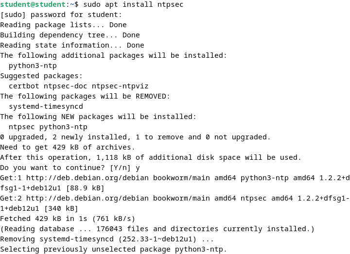

#### Menyesuaikan pool dengan ntp server Indonesia

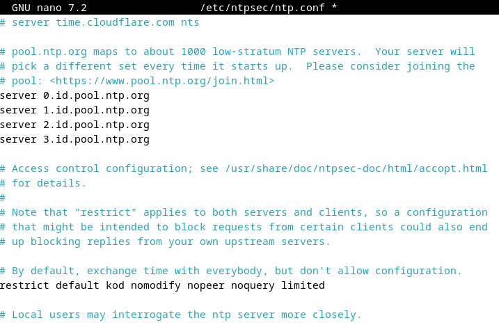

#### Memerika sinkronisasi

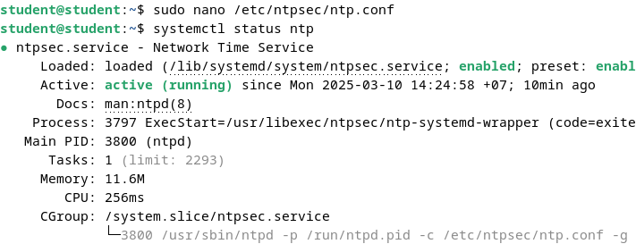

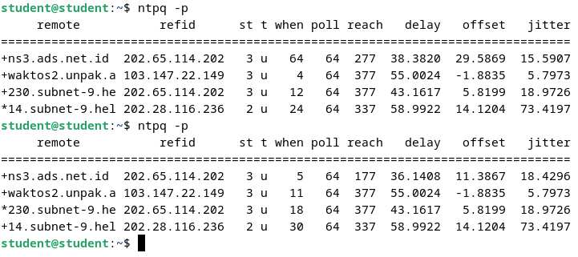

## Konfigurasi Samba

### Instalasi dan Konfigurasi Samba

Samba adalah perangkat lunak open-source yang memungkinkan berbagi file dan printer antara sistem operasi Windows dan sistem mirip Unix (seperti Linux, macOS, dan lainnya). Samba mengimplementasikan protokol SMB/CIFS (Server Message Block/Common Internet File System), yang merupakan protokol yang umum digunakan untuk berbagi file dan printer di jaringan Windows.

#### Instalasi package samba

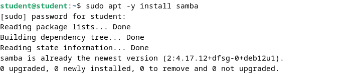

#### Percobaan Fully Access Shared Folder

1. Konfigurasi pada samba

   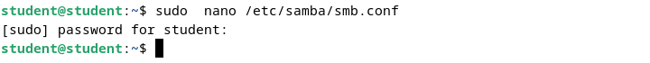

   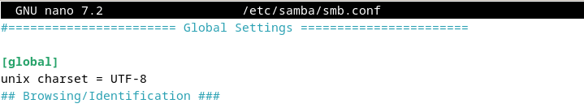

   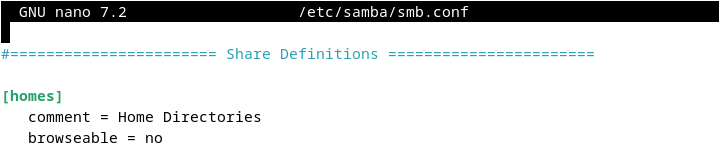

   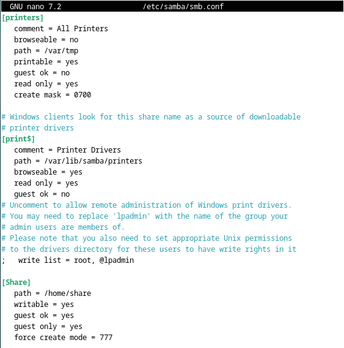

2. Membuat file di direktori /home/share

   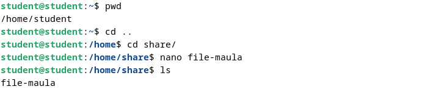

   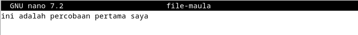

3. Percobaan akses dari host

   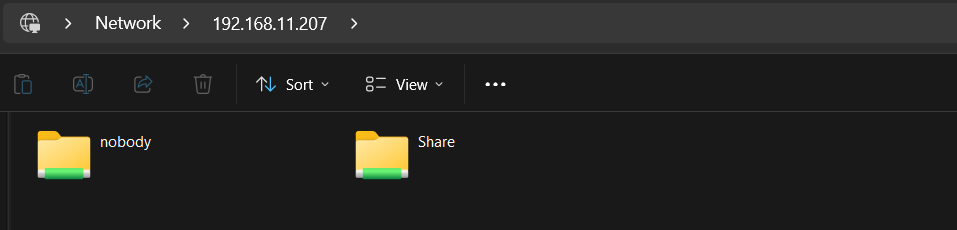

   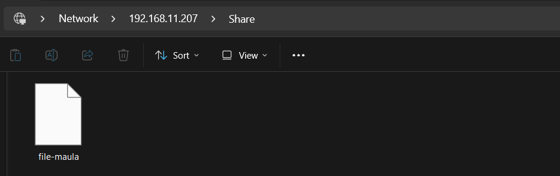

4. Percobaan akses dari komputer lain

   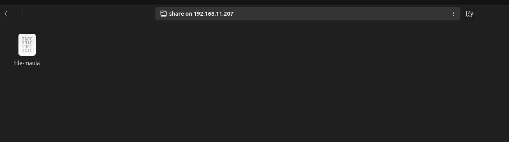

#### Percobaan Limited Share Folder

1. Konfigurasi pada Samba

   

   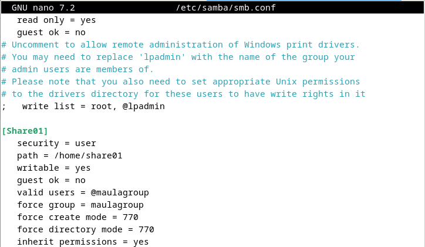

2. Membuat file untuk dibagikan di direktori /home/share01

   

3. Menambahkan user baru

   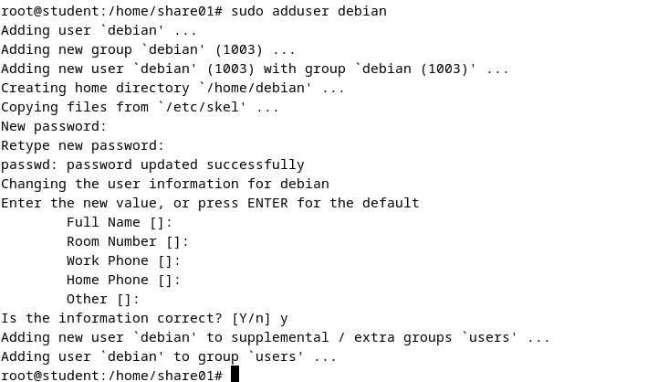

4. Menambahkan user baru ke grup “maulagroup" dan user valid baru ke samba

   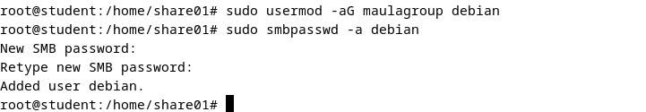

5. Percobaan akses dari host

   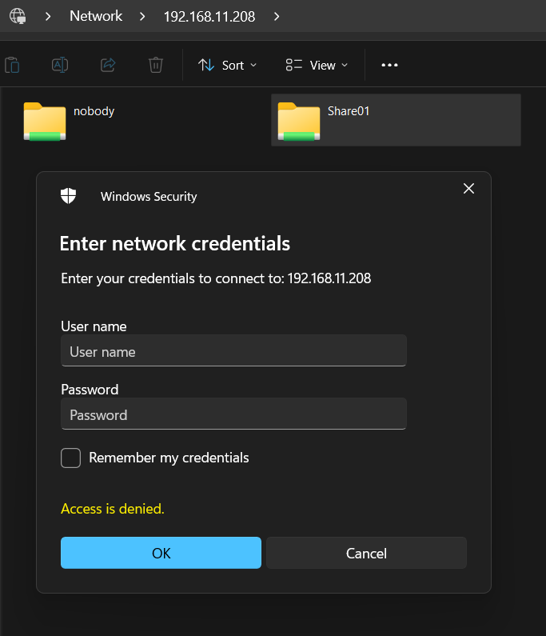

   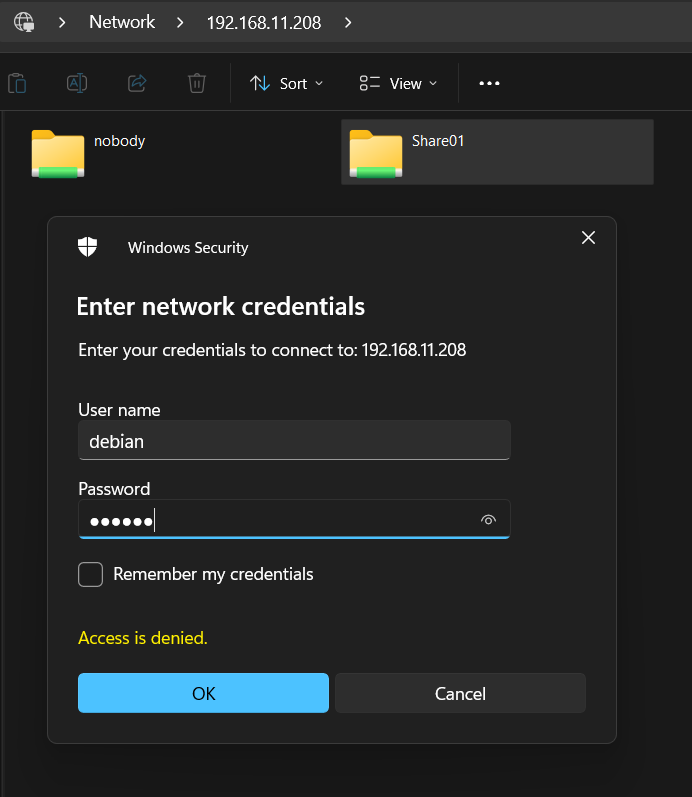

   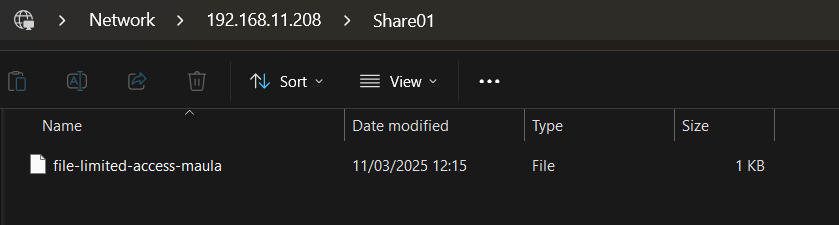

6. Percobaan akses dari komputer lain

   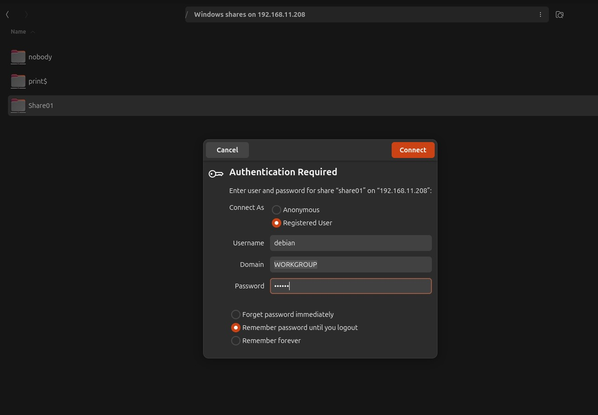

   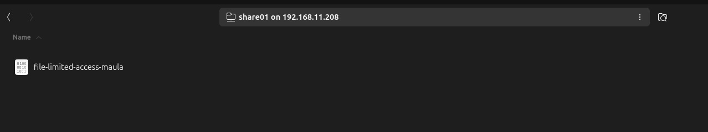

#### Percobaan akses menggunakan CLI dan File Manager

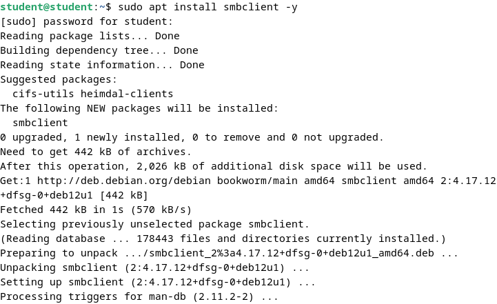


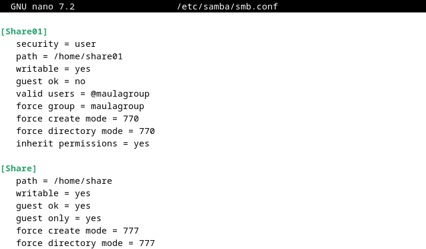

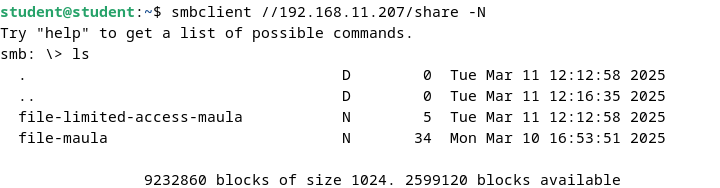

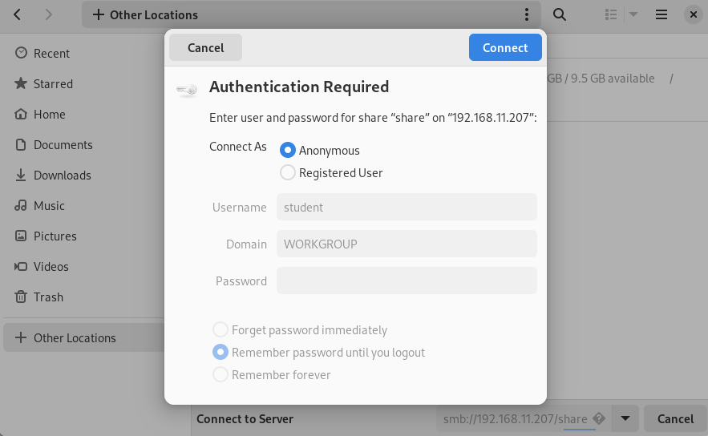

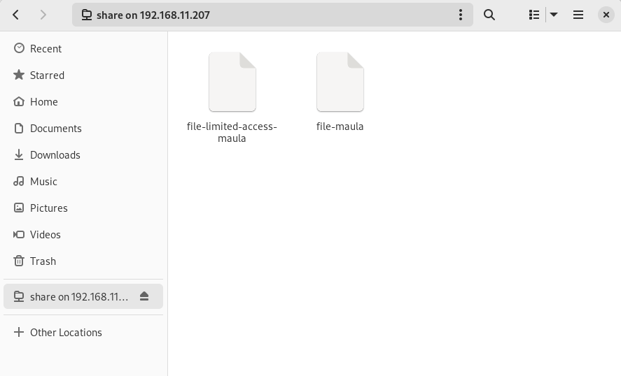

## Package Management

Package manager adalah alat atau perangkat lunak yang digunakan untuk mengelola paket-paket perangkat lunak dalam suatu proyek. Tugas utama package manager adalah memudahkan proses pengunduhan, pemasangan, pembaruan, dan penghapusan paket-paket perangkat lunak yang dibutuhkan oleh suatu proyek. Sistem operasi debian memiliki beberapa alat untuk mengelola paket. Jika dilihat dari penggunaannya ada 2 cara dalam mengelola paket yaitu lewat GUI dan CLI.

### Advanced Package Tool (APT)

Berikut perintah dasar untuk mengelola paket Debian menggunakan APT (Advanced Package Tool) melalui terminal.

#### Perintah “User” untuk Mencari dan Menampilkan Informasi
Perintah ini dapat dijalankan oleh user biasa karena tidak mempengaruhi sistem:

- apt show foo → Menampilkan informasi tentang paket foo.
- apt search foo → Mencari paket yang sesuai dengan kata kunci foo.
- apt-cache policy foo → Menampilkan versi paket foo yang tersedia.

#### Perintah “Administrator” untuk Pemeliharaan Sistem
Perintah ini membutuhkan hak akses root karena berpengaruh pada sistem. Untuk masuk sebagai administrator, ketik su - lalu masukkan kata sandi root.

**Perintah Dasar Administrasi Paket**

- apt update → Memperbarui metadata repositori.
- apt install foo → Menginstal paket foo beserta dependensinya.
- apt upgrade → Memperbarui paket yang terinstal dengan aman.

**Perintah Pembersihan dan Penghapusan Paket**

- apt full-upgrade → Memperbarui paket dengan kemungkinan menambah/menghapus paket lain jika diperlukan.
- apt remove foo → Menghapus paket foo, tetapi menyimpan file konfigurasinya.
- apt autoremove → Menghapus paket yang tidak lagi diperlukan.
- apt purge foo → Menghapus paket foo beserta file konfigurasinya.
- apt clean → Menghapus cache paket yang terinstal.
- apt autoclean → Menghapus cache paket usang.
- apt-mark showmanual → Menampilkan paket yang diinstal secara manual.

**Perintah All-in-One untuk Pemeliharaan Sistem**

Untuk memperbarui repositori, menginstal pembaruan, dan membersihkan cache dalam satu perintah, gunakan:

```bash
apt update && apt full-upgrade && apt autoclean
```

Untuk menghapus paket usang, depedensi tidak terpakai, dan file konfigurasi lama:

```bash
apt autoremove --purge
```

### Software (Simplified Package Manager)

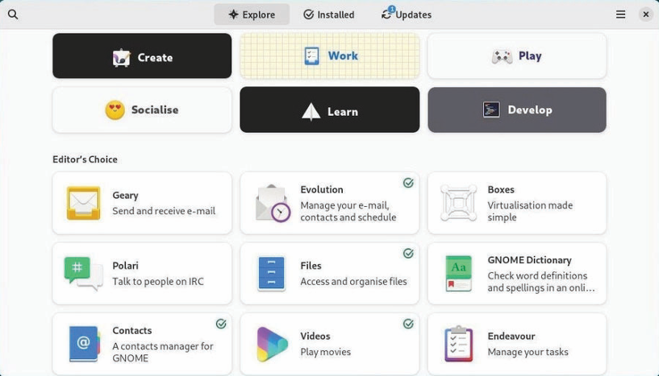

Software adalah alat manajemen paket yang dirancang untuk mempermudah user dalam menginstal, memperbarui, dan menghapus aplikasi pada sistem operasi Linux seperti Debian dan Ubuntu. Berbeda dengan APT yang berbasis terminal, Software menyediakan antarmuka grafis yang lebih mudah digunakan oleh orang awam, memungkinkan pengelolaan aplikasi dengan lebih mudah tanpa perlu memasukkan perintah secara manual. Manajer paket ini cocok bagi user yang mengutamakan kemudahan dalam mengelola perangkat lunak tanpa harus memahami aspek teknis dari sistem manajemen paket yang lebih kompleks.

### Discover: KDE Package Manager

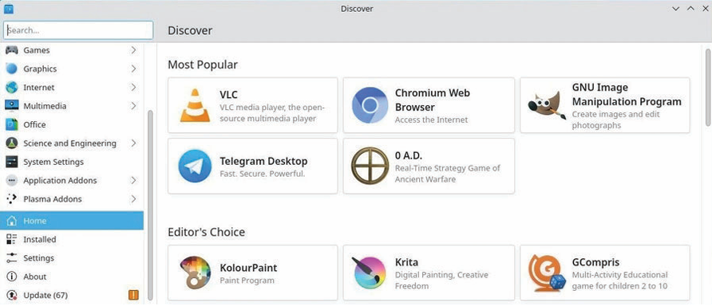

Discover adalah package manager yang dikembangkan untuk lingkungan desktop KDE, menawarkan antarmuka grafis (GUI) yang intuitif dan banyak fitur. Dengan KDE, user dapat berinteraksi dengan sistem melalui elemen visual seperti jendela, ikon, menu, dan panel. Discover memudahkan user dalam mencari, menginstal, memperbarui, serta menghapus paket di Debian. Selain itu, alat ini juga memungkinkan user untuk mengelola dan memodifikasi repositori dengan lebih mudah.

### Synaptic: Comprehensive Package Manager

Synaptic memiliki empat bagian utama dengan fungsi yang berbeda. Panel di sebelah kiri digunakan untuk menyortir dan memilih paket yang ingin dikelola. Panel tengah menampilkan daftar paket beserta detailnya, sedangkan bagian bawah berisi deskripsi dari paket yang dipilih. Jika sebuah paket memiliki logo Debian, itu berarti paket tersebut gratis.

Sebelum menggunakan Synaptic, langkah pertama yang perlu dilakukan adalah menekan tombol Reload untuk memperbarui informasi paket terbaru. Seperti paket lainnya, Synaptic memungkinkan user untuk mencari, menginstal, memperbarui, menghapus paket, serta mengelola repositori dengan mudah.


### Install Paket dengan Gdebi

GDebi adalah alat yang digunakan untuk menginstal paket .deb pada sistem berbasis Debian dan Ubuntu. Dibandingkan dengan dpkg, GDebi lebih unggul karena dapat secara otomatis menangani dependensi, memastikan semua pustaka dan paket tambahan yang diperlukan ikut terinstal. Alat ini tersedia dalam dua versi, yaitu antarmuka grafis (GUI) dan mode terminal (CLI), sehingga memudahkan user dalam menginstal paket tanpa harus mengatur dependensi secara manual.

Jika user ingin menginstal paket dari sumber eksternal, maka paket yang dapat dipasang harus berformat .deb. Salah satu cara termudah untuk menginstal paket .deb adalah dengan menggunakan GDebi. 

### Install Paket dengan Dpkg

Dpkg adalah package manager utama di sistem Debian yang digunakan untuk menginstal, menghapus, dan mengelola paket .deb. Tidak seperti APT, dpkg tidak menangani dependensi secara otomatis, sehingga user harus menginstalnya secara manual.

Dpkg biasanya dijalankan melalui terminal dan dapat digunakan tanpa koneksi internet. Dengan terminal, user bisa memantau proses instalasi dan mengetahui penyebab error jika terjadi masalah.

## Kesimpulan

Instalasi dan konfigurasi NTP (Network Time Protocol) diperlukan untuk sinkronisasi waktu yang akurat pada sistem. User dapat menggunakan Samba untuk berbagi file dan printer antara Linux dan Windows, sehingga integrasi jaringan menjadi lebih mudah. Dalam package management, user dapat menginstal, memperbarui, dan menghapus perangkat lunak dengan berbagai alat seperti APT, Synaptic, GDebi, Dpkg, dan Discover. APT secara otomatis menangani dependensi, Synaptic menyediakan antarmuka grafis (GUI) yang intuitif, GDebi mempermudah instalasi paket **.deb**, Dpkg mendukung pengelolaan paket secara langsung melalui terminal, dan Discover memberikan pengalaman user yang lebih visual dalam lingkungan KDE. Dengan memahami fungsi masing-masing alat, user dapat mengelola sistem Debian dengan lebih efisien.