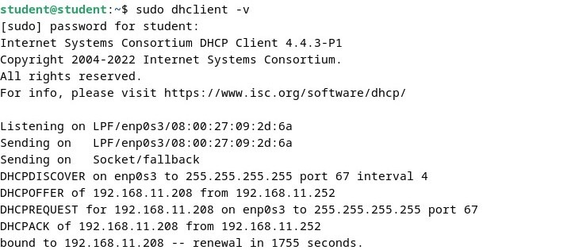
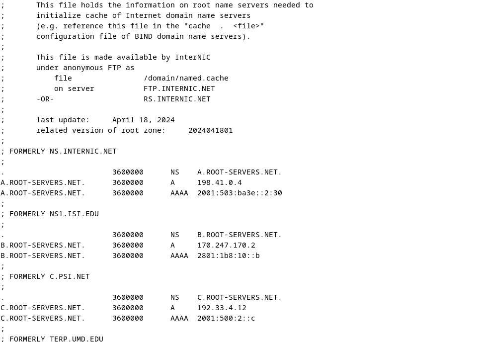

  <h1 style="text-align: center;font-weight: bold">Laporan Workshop Administrasi Jaringan</h1>
  <h4 style="text-align: center;">Dosen Pengampu : Dr. Ferry Astika Saputra, S.T., M.Sc.</h4>

 

  
  <h3 style="text-align: center;">Disusun Oleh :</h3>
  

    <strong>Maula Shahihah Nur Sa'adah</strong> 
    <strong>3123500008</strong>
  

<h3 style="text-align: center;line-height: 1.5">Politeknik Elektronika Negeri Surabaya Departemen Teknik Informatika Dan Komputer Program Studi Teknik Informatika 2024/2025</h3>
  

## Daftar Isi

1. [Ekosistem Internet dan DNS Concept](#ekosistem-internet-dns-concept)
2. [Cara Kerja DNS](#cara-kerja-dns)
3. [Instalasi dan Konfigurasi DNS](#install-kondigurasi-dns) 
4. [Referensi](#referensi)

## Ekosistem Internet dan DNS Concept

### Cek IP address

### File `/etc/nsswitch.conf`

Pada Linux Debian dan sistem Linux lainnya, file `/etc/nsswitch.conf` berfungsi untuk mengonfigurasi Name Service Switch (NSS). File ini mengatur mekanisme pencarian informasi sistem, seperti pengguna, grup, host, dan layanan nama lainnya.

- **passwd, group, dan shadow**: Digunakan untuk memperoleh informasi tentang pengguna dan grup dalam sistem. Jika metode files digunakan, sistem akan mencari data di `/etc/passwd`, `/etc/group`, dan `/etc/shadow`.

- **hosts**: Bertanggung jawab untuk mencocokkan nama host dengan alamat IP. Jika metode files digunakan, sistem akan memeriksa `/etc/hosts` terlebih dahulu. Jika dns digunakan, sistem akan mengandalkan layanan DNS jika pencarian di `/etc/hosts` tidak membuahkan hasil.

- **networks, protocols, services, ethers, dan rpc**: Berfungsi untuk mengambil informasi yang berkaitan dengan jaringan, protokol, layanan, serta berbagai konfigurasi lainnya dalam sistem.

### File `/etc/hosts`

File `/etc/hosts` digunakan untuk menetapkan hubungan antara nama host dan alamat IP secara lokal. Dengan adanya file ini, sistem dapat mengidentifikasi alamat IP tanpa harus bergantung pada layanan DNS (Domain Name System). Oleh karena itu, sistem akan memeriksa entri di `/etc/hosts` terlebih dahulu sebelum beralih ke layanan eksternal seperti DNS.

Untuk menetapkan alamat IP dalam file `/etc/hosts` sehingga komputer dapat mengenali nama host `angel`, lakukan langkah-langkah berikut:

1. Buka file `/etc/hosts`

   

2. Tambahkan entry untuk `angel`

   

3. Uji koneksi dengan `ping`

   

### File `/etc/resolv.conf`

`nameserver` menentukan alamat IP server DNS yang digunakan untuk resolusi domain. Jika terdapat lebih dari satu alamat, sistem akan mencobanya secara berurutan jika terjadi kegagalan. Sementara itu, `search` menambahkan domain saat hanya sebagian nama host diberikan dalam pencarian.

#### Test ping www

Konfigurasi dalam `/etc/resolv.conf` memengaruhi proses resolusi domain melalui dua direktif utama. Direktif `search pens.ac.id` memungkinkan sistem menambahkan domain `pens.ac.id` ke nama host yang tidak lengkap, sehingga saat menjalankan perintah `ping www`, sistem akan mencoba `ping www.pens.ac.id`. Sementara itu, `nameserver 202.9.85.4` dan `nameserver 202.9.85.3` digunakan jika domain tidak ditemukan secara lokal, di mana sistem akan mengandalkan server DNS tersebut untuk menerjemahkan nama domain menjadi alamat IP.

### Root Hints - `/usr/share/dns/root.hints`

File `/usr/share/dns/root.hints` berisi daftar server DNS root yang membantu resolver menemukan server otoritatif untuk domain. File ini digunakan oleh server DNS seperti BIND, Unbound, atau PowerDNS untuk pencarian domain yang tidak tersedia dalam cache atau zona lokal.

## Cara Kerja DNS

DNS bekerja dengan menerjemahkan nama domain ke alamat IP. Prosesnya dapat dijelaskan sebagai berikut:

1. Komputer client mengirim permintaan ke server DNS `192.168.1.53` untuk menemukan `www.example.com.au`.
2. Karena `192.168.1.53` tidak memiliki informasi tersebut, permintaan diteruskan ke server root.
3. Server root memberi instruksi kepada `192.168.1.53` untuk menghubungi `a.b.c.d`.
4. `192.168.1.53` kemudian meneruskan permintaan pencarian ke `a.b.c.d`.
5. Karena `a.b.c.d` hanya mengetahui domain `.au`, server ini mengarahkan `192.168.1.53` ke `e.f.g.h`.
6. `192.168.1.53` melanjutkan pencarian dengan menghubungi `e.f.g.h`.
7. Karena `e.f.g.h` hanya mengetahui domain `.com.au`, server ini menginstruksikan `192.168.1.53` untuk bertanya ke `i.j.k.l`.
8. `192.168.1.53` kemudian meminta informasi domain kepada `i.j.k.l`.
9. `i.j.k.l` mengenali domain `example.com.au` dan mengembalikan informasi alamatnya ke `192.168.1.53`.
10. `192.168.1.53` meneruskan hasil pencarian tersebut kepada komputer client `192.168.1.100`.
11. Setelah seluruh proses selesai, client kini dapat mengakses `www.example.com.au`, yang berada di alamat `m.n.o.p`.

## Instalasi dan Konfigurasi DNS - Kelompok 3

### Configure for Internal Network 

#### Install BIND

#### Konfigurasi dan penyesuaian BIND

`/etc/bind/named.conf`

Menambahkan file konfigurasi baru, `/etc/bind/named.conf.internal-zones`

`/etc/bind/named.conf.options`

Konfigurasi ACL internal-network untuk jaringan `192.168.11.0/24` mengatur akses ke layanan DNS, di mana hanya localhost dan jaringan internal yang diizinkan melakukan query (`allow-query`), sedangkan transfer zona hanya diperbolehkan untuk localhost (`allow-transfer`). Resolusi rekursif diaktifkan (`recursion yes`) untuk pencarian domain eksternal, validasi DNSSEC dikonfigurasi secara otomatis (`dnssec-validation auto`), dan BIND disetel untuk menerima koneksi IPv6 (`listen-on-v6 { any; }`).

`/etc/bind/named.conf.internal-zones`

- **Zona Forward (kelompok3.home)**

    Zona ini berfungsi untuk mengonversi nama domain menjadi alamat IP dan disimpan dalam file `/etc/bind/kelompok3.home.lan`. Berperan sebagai master, menjadikan server ini sebagai sumber resmi data DNS untuk domain tersebut. Selain itu, pembaruan dinamis tidak diperbolehkan dengan konfigurasi `allow-update { none; };`.

- **Zona Reverse (11.168.192.in-addr.arpa)**

    Zona ini digunakan untuk menerjemahkan alamat IP menjadi nama domain (reverse lookup) dan datanya tersimpan dalam file `/etc/bind/11.168.192.db`. Seperti zona forward, zona ini juga berperan sebagai master dengan pembaruan dinamis yang dinonaktifkan.

`/etc/default/named`

Untuk mengatur BIND agar hanya beroperasi dengan IPv4,tambahkan opsi `OPTIONS="-u bind -4"` untuk memastikan BIND dijalankan sebagai pengguna `bind` serta membatasi penggunaan hanya pada IPv4, sehingga menghindari potensi kesalahan pada jaringan yang tidak mendukung IPv6.

### Configures Zone Files

`/etc/bind/kelompok3.home.lan`

`/etc/bind/11.168.192.db`

### Verify Resolution

#### Restart BIND untuk menerapkan perubahan

#### Konfigurasi DNS client untuk menggunakan DNS server sendiri

#### Cek menggunakan nama domain

#### Cek menggunakan IP address

## Referensi

[Configure for Internal Network](https://www.server-world.info/en/note?os=Debian_12&p=dns&f=1)

[Configure Zone Files](https://www.server-world.info/en/note?os=Debian_12&p=dns&f=3)

[Verify Resolution](https://www.server-world.info/en/note?os=Debian_12&p=dns&f=4)