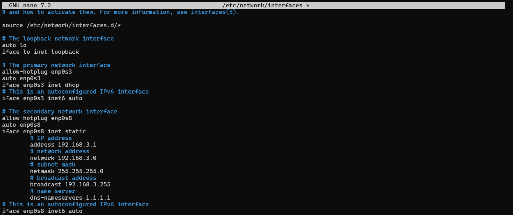
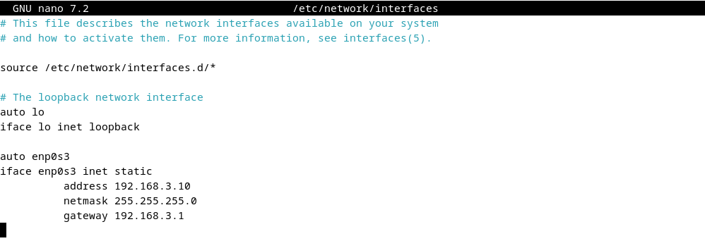

  <h1 style="text-align: center;font-weight: bold">Laporan Workshop Administrasi Jaringan</h1>
  <h4 style="text-align: center;">Dosen Pengampu : Dr. Ferry Astika Saputra, S.T., M.Sc.</h4>

 

  
  <h3 style="text-align: center;">Disusun Oleh :</h3>
  

    <strong>Maula Shahihah Nur Sa'adah</strong> 
    <strong>3123500008</strong>
  

<h3 style="text-align: center;line-height: 1.5">Politeknik Elektronika Negeri Surabaya Departemen Teknik Informatika Dan Komputer Program Studi Teknik Informatika 2024/2025</h3>
  

## Daftar Isi

1. [Konfigurasi pada VM 1 (Server)](#konfigurasi-vm-1)
2. [Konfigurasi NTPSec](#konfigurasi-ntpsec-vm-1)
3. [Konfigurasi File Samba](#konfigurasi-samba-vm-1) 
4. [Konfigurasi DNS Server](#konfigurasi-dns-server-vm-1)
5. [Konfigurasi pada VM 2 (Client)](#konfigurasi-vm-2)
6. [Kesimpulan](#kesimpulan)

Dalam praktikum ini, diperlukan 2 Virtual Machine (VM) yang akan berperan sebagai **Client** dan **Server**.

### Konfigurasi VM 1 (Server)

VM 1 akan berperan sebagai server. Konfigurasi jaringan nya menggunakan dua network adapter, yaitu:

- Bridge Adapter yang digunakan untuk koneksi internet.

- Internal Network yang digunakan untuk komunikasi langsung dengan VM Client.

VM 1 difungsikan sebagai gateway untuk menghubungkan client ke jaringan internet. Selain itu, server ini juga disiapkan dengan beberapa layanan seperti **Samba** untuk berbagi file, **NTPSec** untuk sinkronisasi waktu, dan **Bind9** untuk pengelolaan domain lokal.

#### Konfigurasi Network Adapter

Server dikonfigurasi dengan dua network adapter, yaitu **Bridged Adapter** dan **Internal Network**. **Bridged Adapter** digunakan untuk mengakses jaringan internet melalui koneksi fisik host, sedangkan **Internal Network** digunakan untuk membangun koneksi lokal langsung dengan VM 2 yang berperan sebagai client.

#### Konfigurasi IP Address untuk Koneksi Internal antar VM

1. Cek IP Address

   

2. Akses terminal VM 1 menggunakan SSH

   

   Untuk melakukan konfigurasi pada VM 1 yang berperan sebagai server, koneksi dapat dilakukan secara remote dari host menggunakan protokol SSH (Secure Shell).
   
3. Tambahkan file `/etc/network/interfaces`

   

   Setiap network adapter yang terpasang pada sistem akan secara otomatis diberi nama unik. Pada VM yang digunakan, adapter teridentifikasi sebagai enp0s3 untuk Bridged Adapter dan enp0s8 untuk Internal Network. Adapter enp0s3 dikonfigurasi menggunakan metode DHCP agar dapat memperoleh alamat IP secara otomatis dari jaringan internet. Sementara itu, adapter enp0s8 dikonfigurasi secara manual dan akan berperan sebagai gateway untuk VM client.

#### Aktifkan forwarding di Server

1. `/etc/sysctl.conf`

   

   Untuk membuat sistem berfungsi sebagai router atau gateway, konfigurasi IP forwarding harus diaktifkan. Langkah ini dilakukan dengan mengedit file konfigurasi dan mengaktifkan opsi `net.ipv4.ip_forward`.

2. Lakukan Validasi

   

#### Konfigurasi Iptables

1. Install Paket iptables dan iptables-persistant

   

2. Konfigurasi iptables pada file `/etc/iptables/rules.v4`

   

3. Jalankan perintah `iptables-restore < /etc/iptables/rules.v4` untuk menyimpan konfigurasi iptables

    

#### Reboot

Setelah menyelesaikan seluruh proses konfigurasi, jalankan perintah `reboot` untuk me-restart VM.

### Konfigurasi NTP (NTPSec) pada VM 1

1. Install paket ntpsec

   

2. Konfigurasi server NTP

   

3. Restart service ntpsec, jalankan perintah `systemctl restart ntpsec`

   

4. Kemudian cek menggunakan perintah `systemctl status ntpsec`

   

5. Validasi NTP Server
   
   

### Konfigurasi File Samba pada VM 1

1. Install paket samba

   

2. Buat direktori `mkdir /home/share` dan ubah permission agar bisa diakses `chmod 777 /home/share`

   

3. Konfigurasi samba pada file `/etc/samba/smb.conf`

   

   

4. Restart service dengan perintah `systemctl restart smbd`

   

### Konfigurasi DNS Server pada VM 1 

1. Instalasi paket dengan menjalankan perintah `apt -y install bind9 bind9utils`

   

2. Lakukan modifikasi pada file `/etc/bind/named.conf` dengan menambahkan `include "/etc/bind/named.conf.internal-zones";`

   

3. Modifikasi file `/etc/bind/named.conf.options`

   

4. Konfigurasi internal zone pada file `/etc/bind/named.conf.internal-zones`

   

5. Modifikasi file `/etc/default/named` dengan menambahkan `-4`

   

6. Membuat file sesuai dengan domain lokal

   

7. Membuat file sesuai dengan IP Address

   

### Konfigurasi pada VM 2

VM 2 dikonfigurasi dengan alamat IP yang berada dalam satu jaringan dengan interface internal VM 1 (enp0s3), sehingga keduanya dapat saling terhubung dan berkomunikasi.

#### Cek koneksi dengan melakukan ping ke gateway

#### Cek koneksi dengan melakukan ping ke DNS server

#### Cek koneksi dengan melakukan ping ke domain lokal

#### Tes akses folder dari Samba (Client)

Jika folder **Share** sudah muncul di tampilan file manager client seperti yang terlihat pada gambar, itu berarti konfigurasi Samba di server sudah berjalan dengan benar dan client berhasil mengakses resource sharing yang disediakan oleh server.

#### Cek DNS Server (Client) menggunakan nama domain

Hasil pengecekan menggunakan perintah `dig` menunjukkan bahwa domain `ns.kelompok3.home` berhasil ter-resolve ke alamat IP `192.168.3.1` tanpa adanya error. Hal ini menandakan bahwa konfigurasi DNS pada server sudah berjalan dengan benar dan client dapat mengenali nama domain lokal yang telah ditentukan.

#### Cek DNS Server (Client) menggunakan IP address

Hasil perintah `dig -x 192.168.3.1` menunjukkan bahwa IP tersebut berhasil di-resolve menjadi nama domain `ns.kelompok3.home`. Ini menandakan bahwa konfigurasi reverse DNS (PTR record) pada server telah berhasil dilakukan dengan benar dan sistem DNS sudah dapat menerjemahkan alamat IP menjadi hostname sesuai konfigurasi.

## Kesimpulan

Dalam praktikum ini, saya berhasil mengkonfigurasi dua Virtual Machine, yaitu VM1 sebagai server dan VM2 sebagai client. Saya mengatur server dengan dua adapter jaringan (Bridged Adapter dan Internal Network), kemudian mengaktifkan fitur IP forwarding agar server dapat berfungsi sebagai gateway. Saya juga memberikan IP statis pada masing-masing VM dalam jaringan yang sama agar keduanya dapat saling terhubung. Selain itu, saya menggunakan SSH untuk mengakses server dari client secara remote. Praktikum ini membantu saya memahami cara membangun koneksi jaringan lokal serta mengelola komunikasi antar perangkat virtual secara langsung.