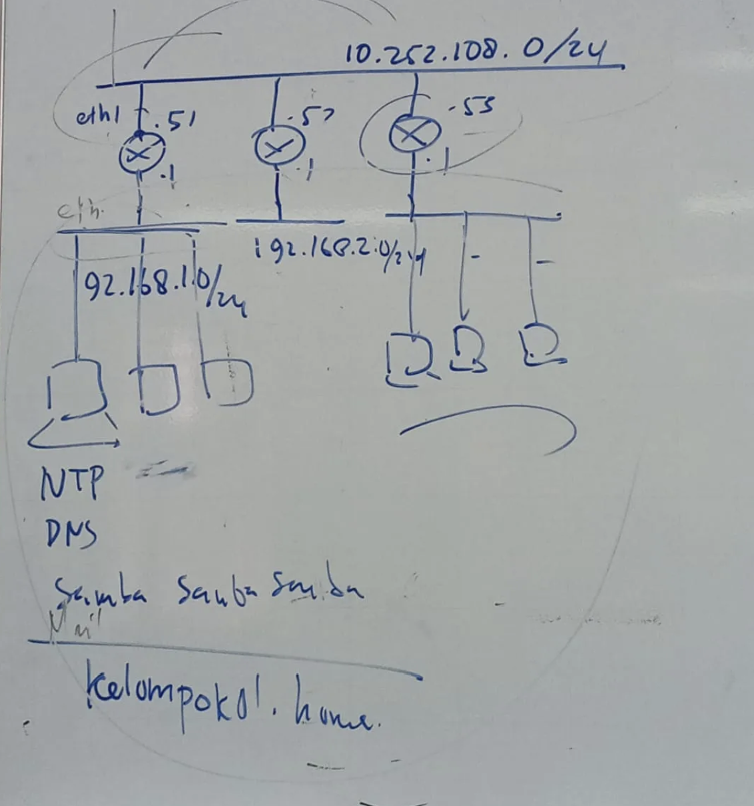
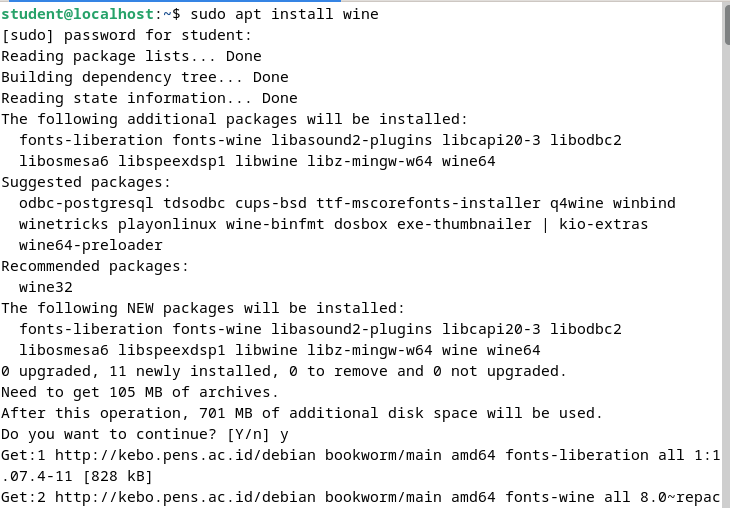
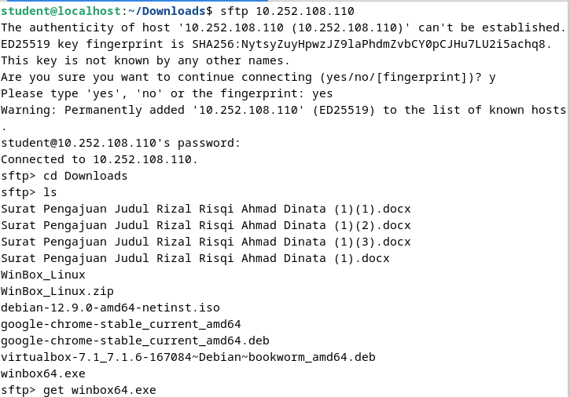
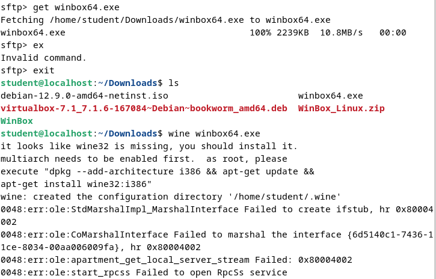
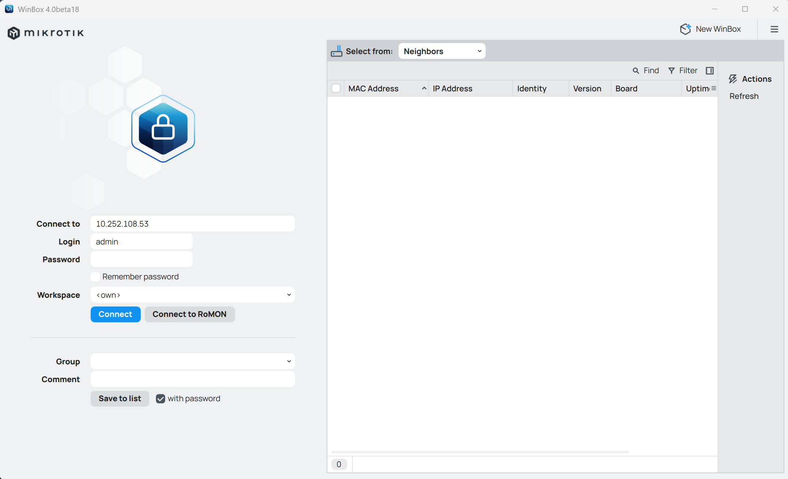
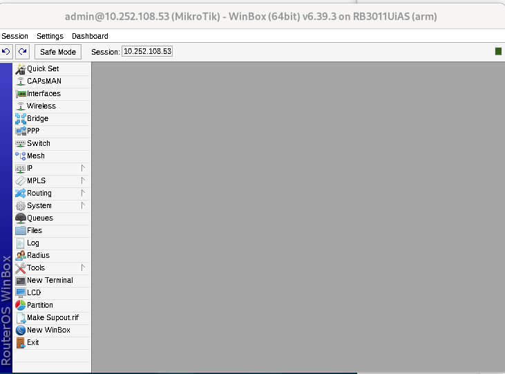
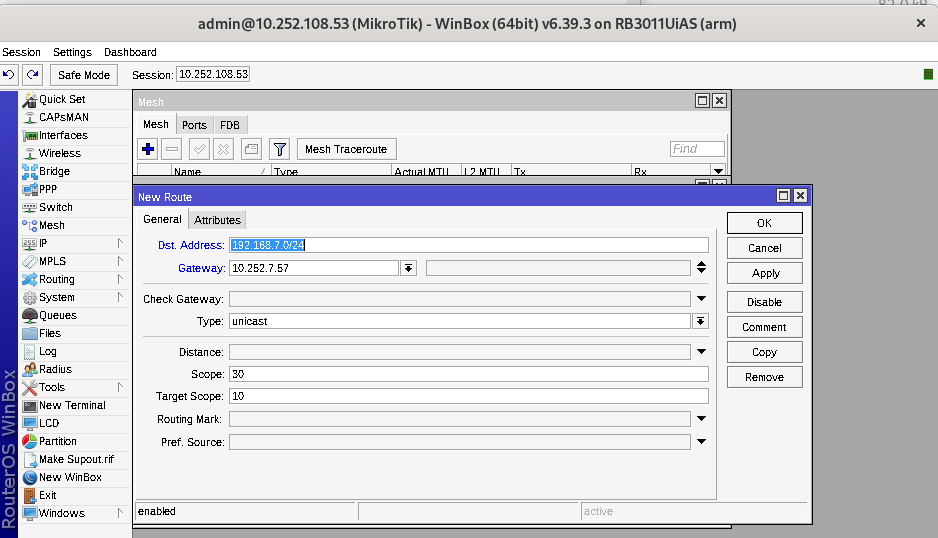
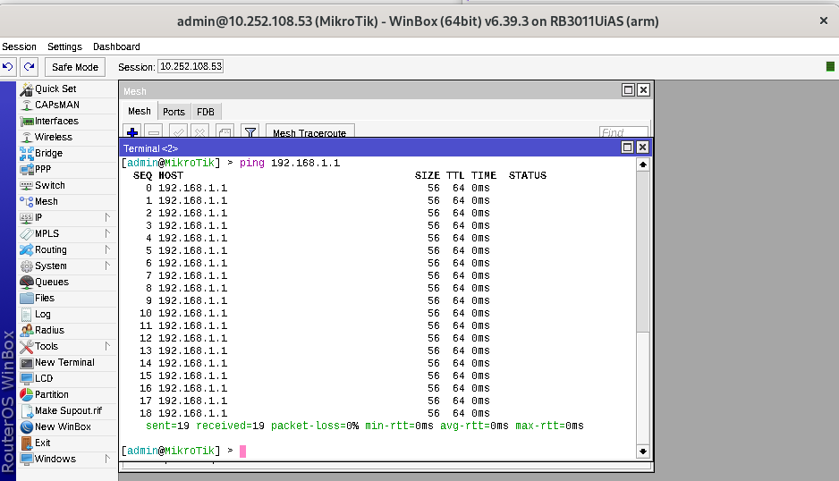

  <h1 style="text-align: center;font-weight: bold">Laporan Workshop Administrasi Jaringan</h1>
  <h4 style="text-align: center;">Dosen Pengampu : Dr. Ferry Astika Saputra, S.T., M.Sc.</h4>

 

  
  <h3 style="text-align: center;">Disusun Oleh :</h3>
  

    <strong>Maula Shahihah Nur Sa'adah</strong> 
    <strong>3123500008</strong>
  

<h3 style="text-align: center;line-height: 1.5">Politeknik Elektronika Negeri Surabaya Departemen Teknik Informatika Dan Komputer Program Studi Teknik Informatika 2024/2025</h3>
  

## Daftar Isi

1. [Tugas](#tugas)
2. [Hasil Percobaan](#hasil-percobaan)

## Tugas 

1. Melakukan Instalisasi Winbox 
2. Konfigurasi Layer Network
   Percobaan awal yang dilakukan berdasarkan skema di atas adalah menghubungkan perangkat MikroTik antar kelompok. Tujuan dari langkah ini adalah agar setiap laptop yang tergabung dalam jaringan LAN dapat saling berkomunikasi, khususnya melakukan uji koneksi (ping) ke IP kelompok lainnya. 
   
   Untuk melakukan hal tersebut, salah satu laptop dari setiap kelompok perlu dihubungkan ke jaringan LAN dan menjalankan perintah ping guna menguji konektivitas. Pada percobaan ini, digunakan rentang alamat IP 10.252.108.5x, di mana x mewakili nomor kelompok masing-masing. Karena saya kelompok 3, maka IP MikroTik yang digunakan adalah 10.252.108.53. 
   
   Setelah perangkat berhasil terhubung ke jaringan melalui kabel LAN, pengujian koneksi dapat dilakukan melalui Command Prompt di sistem operasi Windows dengan menggunakan perintah ping terhadap IP tujuan.
3. Ping device kelompok lain sesuai networknya

## Hasil Percobaan

1. Install Wine
   
   

   Installasi ini diperlukan agar bisa melakukan install aplikasi Winbox di Linux. Kemudian, instalasi ini akan menginstal Wine, yang merupakan sebuah emulator untuk Windows. Wine ini digunakan untuk membuat aplikasi yang dibuat untuk Windows, dapat dijalankan di Linux. 

2. Install Winbox dengan sftp kelompok 5 

   

   

3. Mencoba ping network 10.252.108.53

   

   Berdasarkan hasil di atas, network milik kelompok 3 terdeteksi saat terhubung ke LAN dengan alamat IP 10.252.108.53

4. Connect Winbox ke Mikrotik dengan IP address 10.252.108.53
    
   

   

5. Mencoba ping network 192.168.1.0/24 di Mikrotik (Kelompok 1)

   

   Pada bagian IP, pilih menu Routes, kemudian tambahkan network 192.168.1.0/24 dan isi kolom gateway dengan 10.252.108.51 (pada gambar di atas merupakan konfigurasi untuk kelompok 7). Setelah konfigurasi selesai, klik button OK.

   Sembunyikan (hidden) IP yang tidak terhubung ke perangkat MikroTik untuk menghindari kebingungan. Selanjutnya, lakukan pengujian koneksi dengan menjalankan perintah ping ke IP address 10.252.108.51 melalui Command Prompt. 
   
   Sebagai contoh, gambar di bawah ini menunjukkan hasil ping ke IP 192.168.1.0
  
   

   Jika test ping seperti pada langkah sebelumnya berhasil dilakukan, dan setiap uji koneksi tidak menunjukkan status request timed out atau pesan kesalahan lainnya, maka dapat disimpulkan bahwa koneksi antar device dari kelompok yang berbeda telah berhasil dilakukan.
   