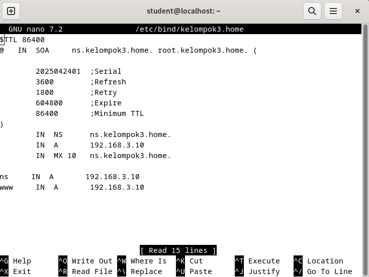
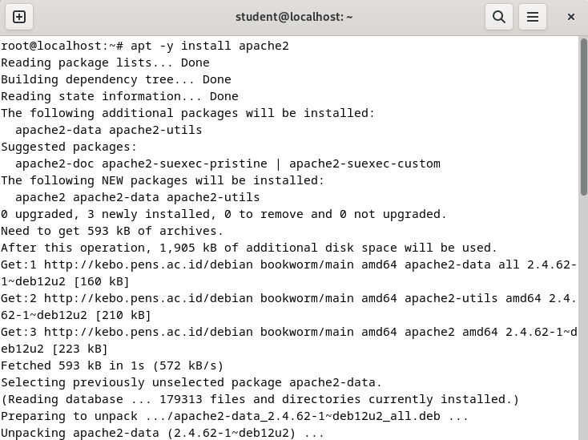

<div align="center">
  <h1 style="text-align: center;font-weight: bold">Laporan<br>Workshop Administrasi Jaringan</h1>
  <h4 style="text-align: center;">Dosen Pengampu : Dr. Ferry Astika Saputra, S.T., M.Sc.</h4>
</div>
<br />
<div align="center">
  
  <h3 style="text-align: center;">Disusun Oleh :</h3>
  <p style="text-align: center;">
    <strong>Maula Shahihah Nur Sa'adah</strong><br>
    <strong>3123500008</strong>
  </p>

<h3 style="text-align: center;line-height: 1.5">Politeknik Elektronika Negeri Surabaya<br>Departemen Teknik Informatika Dan Komputer<br>Program Studi Teknik Informatika<br>2024/2025</h3>
  <hr><hr>
</div>

## Daftar Isi

- [Tugas](#tugas)
- [Percobaan](#percobaan)
  - [A. Mengubah IP sesuai dengan IP Kelompok](#a-mengubah-ip-sesuai-dengan-ip-kelompok)
  - [B. Konfigurasi Jaringan Internal](#b-konfigurasi-jaringan-internal)
    - [Konfigurasi Zone File](#konfigurasi-zone-file)
    - [Konfigurasi DNS Client untuk menggunakan DNS Server sendiri](#konfigurasi-dns-client-untuk-menggunakan-dns-server-sendiri)
    - [DNS Query menggunakan DiG (Domain Information Groper) untuk Forward Lookup.](#dns-query-menggunakan-dig-domain-information-groper-untuk-forward-lookup)
- [C. Konfigurasi Web Server](#c-konfigurasi-web-server)
    - [Instalasi Apache2](#instalasi-apache2)
    - [Konfigurasi Apache2](#konfigurasi-apache2)


## Tugas
 

 

## Percobaan

### A. Mengubah IP sesuai dengan IP Kelompok

- Masuk ke menu *Settings* > *Network* > *IPv4*, lalu pilih bagian *IPv4 Address* untuk mulai mengatur alamat IP secara manual.
  
    

    Pada tahap ini, kita akan mengatur konfigurasi IPv4 secara statik dengan memilih opsi *Manual*, sehingga IP dapat disesuaikan dengan IP Kelompok. Untuk Kelompok 3, `IP Server` yang digunakan adalah `192.168.3.10/24`, dengan `Gateway` pada `192.168.3.1`, dan `Netmask` sebesar `/24`. Selain itu, bagian DNS diisi dengan beberapa alamat, yaitu `192.168.3.10` (IP DHCP Client), `10.252.108.10` (Master DNS), `10.10.10.1` (Web Server), dan `202.9.85.2` (Mail Server).

    

    Jika sudah berhasil akan muncul detail seperti gambar diatas.

- Cek IP yang telah di set menggunakan perintah `ip a`

    

    Berdasarkan hasilnya, IP dari client sudah sesuai yaitu `192.168.3.10` 

-  Ping IP Master DNS  

    

    Berdasarkan hasil yang diperoleh, koneksi ke Master DNS berhasil dilakukan.

- Update Package 
  
    

    Saat mencoba melakukan update package, muncul error seperti yang ditunjukkan pada gambar di atas karena perangkat belum terhubung ke internet. Masalah ini kemungkinan disebabkan oleh pengaturan IP yang belum sesuai dengan IP kelompok. Oleh karena itu, solusi yang dapat dilakukan adalah melakukan konfigurasi ulang pada file `/etc/network/interfaces`

    

    Pada bagian ini, kita akan melakukan pengaturan IPv4 secara statik dengan menyesuaikan alamat IP berdasarkan jaringan kelompok. Untuk kelompok 3, IP yang digunakan adalah `192.168.3.10/24` dengan network address `192.168.3.0/24`

    

    Setelah itu, lakukan `apt update` sebagai root. Update berhasil dilakukan.

### B. Konfigurasi Jaringan Internal
    
-  Install BIND
  
    Masuk sebagai root lalu install BIND dengan perintah berikut.

    ``` bash
    root@dlp:~# apt -y install bind9 bind9utils
    ```

    

    Setelah itu, buka file `/etc/bind/named.conf` dan tambahkan konfigurasi untuk *internal zone*.

    

    Lalu, edit file `/etc/bind/named.conf.local` pada bagian *acl internal-network* dengan menambahkan network kelompok, yaitu `192.168.3.0/24`

     ```bash 
    root@dlp:~# nano /etc/bind/named.conf.options
    acl internal-network {
        192.168.3.0/24;
    };
    ```

    

    Tambahkan nama domain dan zona network untuk kelompok 3 dengan perintah berikut.

    ```bash 
    root@dlp:~# nano /etc/bind/named.conf.internal-zones
    zone "kelompok3.home" IN {
        type master;
        file "/etc/bind/db.kelompok3.home";
        allow-update { none; };
    };
        
    zone "3.168.192.in-addr.arpa" IN {
        type master;
        file "/etc/bind/3.168.192.db";
        allow-update { none; };
    };
    
    ```
    

    Selanjutnya, buka file `/etc/bind/named` dan tambahkan opsi `OPTIONS="-u bind -4"` untuk menginstruksikan BIND agar hanya menggunakan IPv4. Hal ini dilakukan karena jaringan kita hanya mendukung IPv4 dan bertujuan untuk menghindari munculnya log error terkait IPv6.

    

#### Konfigurasi Zone File
  
Untuk konfigurasi zone file, masuk di `/etc/bind/db.kelompok3.home` dan `/etc/bind/3.168.192.db`, lalu edit dengan perintah berikut.

- `/etc/bind/db.kelompok3.home`
  
    

- `/etc/bind/3.168.192.db`
  
    

- Restart bind dengan perintah `systemctl restart named`
  
#### Konfigurasi DNS Client untuk menggunakan DNS Server sendiri
    
- Edit file `/etc/resolv.conf` dengan perintah berikut.
  
    ``` bash
    root@dlp:~# nano /etc/resolv.conf
        nameserver 192.168.3.10
        nameserver 10.252.108.10
        nameserver 10.10.10.1
        nameserver 202.9.85.2
    ``` 

-  Restart DNS client dengan perintah `systemctl restart networking`

    
    
#### DNS Query menggunakan DiG (Domain Information Groper) untuk Forward Lookup.

- Testing dengan cara mencari nama domain (hostname) berdasarkan IP Address.  
  
    

    IP Address `192.168.3.10` terdaftar sebagai host untuk layanan **web (www)** dan **nameserver (ns)** dari domain lokal `kelompok3.home`

- Testing dengan cara mencari alamat IP berdasarkan nama domain (hostname).  
  
    

    Perintah **dig ns.kelompok3.home** menunjukkan bahwa domain `ns.kelompok3.home` telah dikenali oleh server DNS dan berhasil dipetakan ke IP `192.168.3.10`, yang menandakan bahwa DNS server berfungsi dengan baik.

### C. Konfigurasi Web Server

####  Instalasi Apache2
  
- Masuk sebagai root lalu install apache dengan perintah berikut.

    ``` bash
    root@dlp:~# apt -y install apache2
    ```
  
    

#### Konfigurasi Apache2

- Konfigurasi security 
  
    

- Konfigurasi directory index 
  
    

- Konfigurasi server name 
  
    

- Konfigurasi email administrator 
  
    

- Restart apache2
    
    

    Setelah proses reload konfigurasi berhasil, pengujian dapat dilakukan dengan mengakses domain melalui browser.

    

    